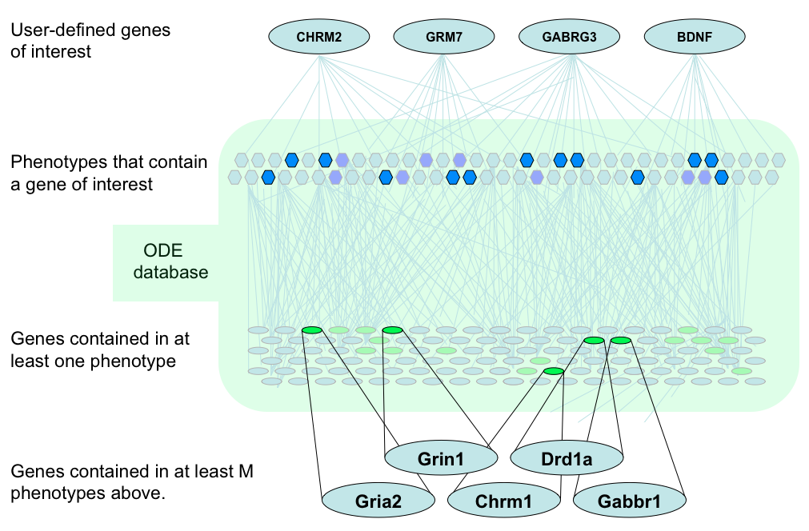
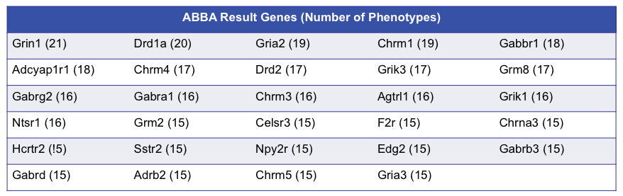
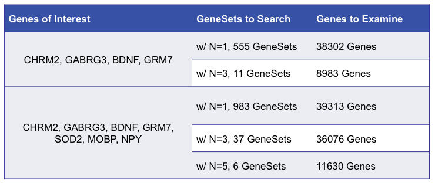

## ABBA

Given a set of interesting genes, do other genes have similar relationships to known sets of genes? For example, given a set of genes known to be related to drug abuse, what other genes share similar expression patterns in drug abuse gene sets? By answering this question, it becomes possible to elucidate under-studied or obfuscated genes that may play a role in complex phenotypes.

We have developed a new GeneWeaver tool to address this question, which we call __Anchored Biclique of Biomolecular Associations (ABBA)__. This tool takes advantage of the large number of collected data and cross-species integration to find new genes for investigation.

The search begins with a user-provided list of genes of interest, such as highly-studied genes with known pathways and relationships. The database then finds any gene sets that contain at least N of the genes in the provided list. From the resulting list of gene sets, ABBA then isolates any genes that occur in at least M GeneSets but not in the initial list. These resulting genes share similar gene set overlap with the original input set, but may not have been previously considered in relation to the gene set of interest.

 

In the above figure, the lighter nodes indicate less overlap. Using N=2 produces a collection of 37 GeneSets as of 7 July 2010. For brevity, only the top 5 results are shown above. With M=15, the following table lists genes in the result having similar relationships to the input set.

Without reasonable thresholds, the results quickly become overwhelming. As of this writing, a simple set of 4 genes of interest results in 555 GeneSets and over 38,000 genes in the candidate list. Increasing the input set to 7 genes of interest results in 983 GeneSets and almost 40,000 genes. Simply requiring gene sets to contain at least 3 genes significantly reduces the search space to 11 and 37 GeneSets, respectively.

