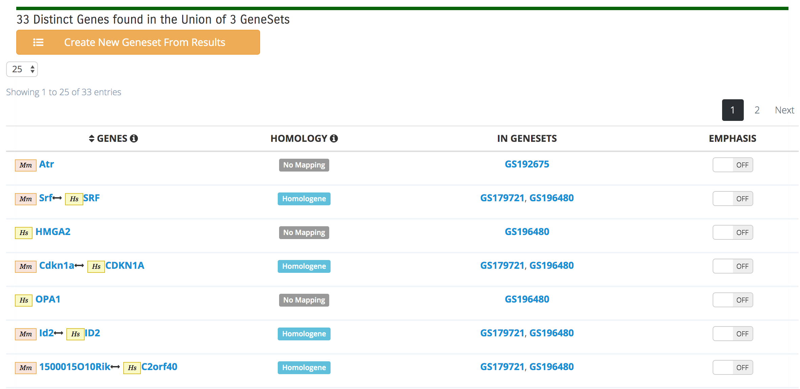

## Boolean Algebra

The Boolean Algebra Tool performs basic set operations on at least two Gene Sets.
Results are displayed as lists of genes beloging to one of the three different types of
set operations: Union, Intersect, and Symmetric Difference. Furthermore, results allow
users to quickly determine new relationships between Gene Sets and create a new Gene Set
based on set-derived findings.

### Using the Boolean Algebra Tool

Access the Boolean Algebra Tool through
the [Analyze Genesets](index.md#analyze-gene-sets-tab) tab, located in the left-hand
column and distinguished by the Venn diagram icon.

To generate Boolean Algebra results, select either a Project of two or more Gene Sets or
at least two individual Gene Sets from a project. Next, select the appropriate Boolean
Algebra function. These functions are based on basic _Set Algebra_: **Union**, 
**Intersection**, **Symmetric Difference**.

* **Union**: This tool generates a set of all genes located in all sets. It removes
  duplicates by default. The results will display what homology mapping was used to
  generate a gene entry.

This result shows the union of three Gene Sets, two mouse and one human.

* **Intersection**: This option will cause the Boolean tool to return all genes in
  common with the selected Gene Set inputs. It has an additional option (_"Genes must
  intersect in at least X"_) that specifies the minimal amount of overlaps required to
  return a result. If a minimal overlap is set to _3_, for example, only Gene Sets that
  intersect with 3 or more genes will be evaluated, and only the intersecting genes will
  be returned. In addition, results are divided into separate groups based on the number
  of genes in their intersections.

These three Gene Sets have 4 genes in common. All of them are homologs between mouse and
human.

Changing the overlap to 2 created two sets of results, those in all 3 Gene Sets and
those in only 2 of the Gene Sets.

* **Symmetric Difference**: This tool will create a set of genes that are unique to the
  Gene Sets selected as input. It effectively finds the Union of all Gene Sets minus the
  intersection of those Gene Sets.

In this example, there is a result set of unique genes for each input Gene Set.

### Managing Results

A table located just below the circle overlap diagram and above the results is intended
to display a broad survey of genes included in the input Gene Sets, categorized by
species. It lists: _Genes Specific to Species_, _Genes In Common with at Least One Other
Species_, and _Total Number of Genes_. These values are based on the total number of
genes in the input sets, and may not specifically represent results. The table is
intended to help aid in the selection of which species to map the results in cases where
new Gene Sets are created.

Genes returned by the Boolean Algebra tool can be added to new Gene Sets. To do this,
click on the **Create New Gene Set From Results** button for the group you want.

Since results can contain genes from a mixed set of species, a species must be selected
for mapping the genes in the new Gene Set.

The standard Upload GeneSet page will open. The genes will be listed in the gene
information section. If no species is selected, no genes will be listed. You can now
edit any of the fields to change the Gene Set name, description, etc. Follow
the [Upload GeneSet](#uploading-gene-sets) procedure. It is also important to note that
very large gene lists may take a few moments to load, during which time the user may
experience a dimmed 'Loading' screen.

### Circle Overlap Diagram

If the user selects 10 or fewer Gene Sets, a gene overlap diagram will appear near the
top of the results page. The **Circle Overlap** representation is an approximation of
Euler fractional overlaps. It represents how the input genesets relate to each other. It
uses the same homology mapping as the Boolean Algebra tool to render the approximate
fractional overlap of the genes shared between each set.

