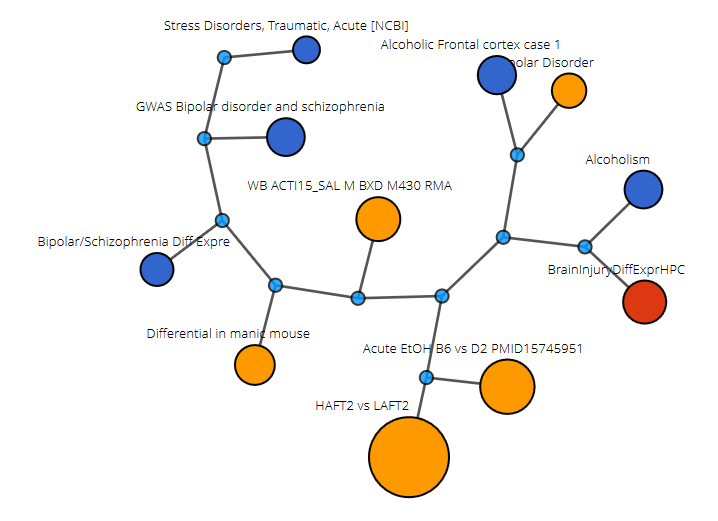
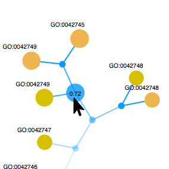
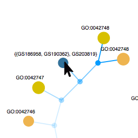
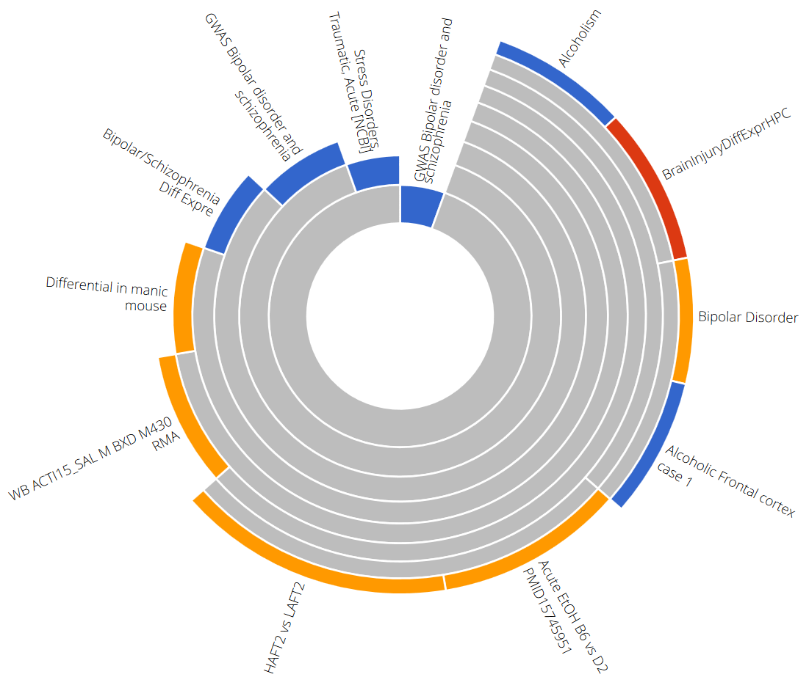

**Clustering**
==============

Why Use the Clustering Tool
----------

Clustering is one of the most powerful tools in bioinformatics, where classifications are too strict for data distinction, clustering helps give the user an evaluation that is not so distinct.

### Using the Clustering Tool

1.  Select the gene sets from your list of projects that you would like
    to analyze.
    -   You need a minimum of 3 gene sets in total to run the tool.

2.  Select if homology is to be included or excluded.
    -   Homology is included by default.

3.  Select the method of clustering.
    -   Average is the default method of clustering.
    -   There are five methods of clustering. They are listed in the
        methods section.

### Understanding your Results

#### Visualization Types

There are two methods for visualizing your clustering results.

**Force Directed Graph**

-   Tree representation of each cluster.
-   Clear depiction of hierarchy.
-   The most opaque node of a tree represents the clusters root.

-   Each node is classified as one of the following:
	-   **Cluster** - Grouping of gene sets
		-   The opacity of the nodes is based on the Jaccard Similarity of its children. The more similar the gene sets, the darker the cluster.
		-   On Hover: Reveals Jaccard Similarity of its child nodes. Reveals set notation of the containing hierarchy.
                
   
   		
* 		On Click: Collapses (absorbs its children).

   
   
   
  	-   **Gene Set** - A set of genes
  		-   Colored based on the species contained in the gene set study.
  		-   Sized based on the relative size of the gene set.
  		-   On Hover: Reveals abbreviated gene set information.
  		-   On Click: Reveals and cycles through genes in groups of ten.
  		-   On Double Click: Opens a new page containing extensive gene set information.
          
  	-   **Gene**
  		-   On Hover: Reveals the name of the gene.
  
  	-   **Edges**
      	-   Connects nodes to its children.
      	-   The opacity of edges leading from cluster nodes is based on the cluster nodes Jaccard Similarity, following the same scale as above.
    
**Partitioned Sunburst**

-   Top-down view of each tree.
-   Center represents the root.
-   Partitioned sub-circles represent clusters, gene set or gene.

-   **Partition**
    -   Partitions are the equivalent to nodes in a tree
    -   Each parition is classified as one of the following:
        -   **Cluster** - Grouping of gene sets
            -   On Hover: Reveals Jaccard Similarity of its child
                partition and highlights all nodes within the cluster.
            -   On Right Click: Opens a new "View GeneSet Overlap" page
                using all gene sets in the cluster as input.
        -   **Gene Set** - A set of genes
            -   Colored based on the species contained in the gene
                set study.
            -   Drawn arc sizes are based on the relative size of the
                gene set.

			-   On Right Click: Opens a new "View GeneSet Details" page for the
        given gene set.
-   **Rings**
    -   Each Ring represents a level in the tree.
    -   The outer most levels are gene sets.
    -   The levels leading up to a gene set represents the hierarchy of
        the cluster.

Clustering Methods
------------------

Listed below are the six different methods that the user can choose from
while running the tool. The first five are different clustering methods
that will run on the selected genesets and display a force directed tree
and a partitioned sunburst based on the clustered genesets.

All five of the given clustering methods are agglomerative hierarchical
clustering methods that start with each geneset belonging to its own
cluster. They then combine the clusters at each iteration based off of a
described linkage method that determines how the distance between two
clusters is defined. The clusters are combined until there are no more
clusters that are similar to each other (the distance between them is
too large).

### McQuitty

The McQuitty clustering method uses a linkage method where distance
depends on the combination of clusters instead of the individual
genesets within each cluster. When two clusters are joined together, the
distance of the new cluster to any other cluster is calculated as the
average distance between the two clusters that are being joined and the
other cluster. For example, if clusters 2 and 4 have the greatest
similarity and we are going to combine them into a new cluster called
2+4, then the distance from 2+4 to 1 is the average of the distances
from 2 to 1 and 4 to 1.

-   **Algorithm**
    -   Each gene set is initialized as its own cluster.
    -   The initial similarity between each cluster is the Jaccard
        Similarity of the two genesets.
    -   While we still have similar clusters:
        -   Clusters with highest similarity are clustered together.
        -   Calculates the similarity between the new cluster and all
            the rest based on the McQuitty linkage method
-   **Time Complexity**
    -   O(n^2^ log n)
    -   This method is the most time efficient.

### Ward

The Ward clustering method uses a linkage method where the distance
between two clusters is based off of the Jaccard Similarity score
between them. When two clusters are joined together, the new cluster
will take the union of the genesets in the two clusters that are being
joined and set that as its geneset. It will then calculate the new
geneset's similarity score against all the other cluster's genesets and
that will be set as the distance between the new cluster and all the
other clusters.

-   **Algorithm**
    -   Each gene set is initialized as its own cluster
    -   The initial distance between clusters is the Jaccard Similarity
        score between each of the cluster's genesets
    -   While we have clusters that are similar to each other:
        -   Clusters with highest similarity are clustered together.
        -   The new cluster contains a geneset which is the union of its
            children's genesets
        -   Recalculates the Jaccard Similarity score between the new
            cluster and all the other clusters
-   **Time Complexity**
    -   O(n^3^)

### Complete

The Complete clustering method uses a linkage method where the distance
between two clusters is the lowest similarity score between any of the
genesets in one cluster compared to any of the genesets in the other
cluster. When two clusters are combined, the genesets within each of the
clusters are put into a new cluster. No new calculations are needed at
each iteration because we are simply reusing the similarity scores of
all the genesets compared to each other.

-   **Algorithm**
    -   Each gene set is initialized as its own cluster.
    -   The similarity scores of all the genesets compared to each
        other are saved in a matrix
    -   While we still have clusters that are similar:
        -   Determine which two clusters to join:
            -   The distance between two clusters is the lowest
                similarity score between a geneset in one cluster and a
                geneset in the other cluster
            -   The highest of these distances determines which two
                clusters will be joined
        -   Combines the two clusters to create a new cluster that has
            all the genesets that were present in the two children
            clusters
-   **Time Complexity**
    -   O(n^3^)

### Average

The Average clustering method uses a linkage method where the distance
between two clusters is the average similarity score between all of the
genesets in one cluster compared to all of the genesets in the other
cluster. When two clusters are combined, the genesets within each of the
clusters are put into a new cluster. No new calculations are needed at
each iteration because we are simply reusing the similarity scores of
all the genesets compared to each other.

-   **Algorithm**
    -   Each gene set is initialized as its own cluster.
    -   The similarity scores of all the genesets compared to each
        other are saved in a matrix
    -   While we still have clusters that are similar:
        -   Determine which two clusters to join:
            -   The distance between two clusters is the average
                similarity score between every geneset in one cluster
                and every geneset in the other cluster
            -   The highest of these distances determines which two
                clusters will be joined
        -   Combines the two clusters to create a new cluster that has
            all the genesets that were present in the two children
            clusters
-   **Time Complexity**
    -   O(n^3^)

### Single

The Single clustering method uses a linkage method where the distance
between two clusters is the highest similarity score between any of the
genesets in one cluster compared to any of the genesets in the other
cluster. When two clusters are combined, the genesets within each of the
clusters are put into a new cluster. No new calculations are needed at
each iteration because we are simply reusing the similarity scores of
all the genesets compared to each other.

-   **Algorithm**
    -   Each gene set is initialized as its own cluster.
    -   The similarity scores of all the genesets compared to each
        other are saved in a matrix
    -   While we still have clusters that are similar:
        -   Determine which two clusters to join:
            -   The distance between two clusters is the highest
                similarity score between any geneset in one cluster and
                any geneset in the other cluster
            -   The highest of these distances determines which two
                clusters will be joined
        -   Combines the two clusters to create a new cluster that has
            all the genesets that were present in the two children
            clusters
-   **Time Complexity**
    -   O(n^3^)
