**DBSCAN Gene Clustering**
==========================

What is DBSCAN?
---------------

DBSCAN (Density-Based Spatial Clustering of Application with Noise) is a clustering algorithm that groups genes into clusters based on how closely related the genes are.

### Why Use the DBSCAN Tool?

In general, clustering is used to find patterns or outliers within data sets. In this implementation of DBSCAN, genes in the same cluster would be considered similar, while genes in different clusters would be less similar. An explanation of DBSCAN can be found [here](https://en.wikipedia.org/wiki/DBSCAN). Within Geneweaver, this tool can be used to infer relationships between genes. For example, if clusters with similar genes continue to appear in tests across multiple data sets, one could say that these genes are closely related.

DBSCAN Parameters
-----------------

DBSCAN takes in 2 parameters, epsilon and minPoints.

### The Epsilon Parameter

Epsilon determines how close the genes need to be in order to be
considered in the same cluster. For example, an epsilon of 1 means that
genes need to share at least 1 gene set. Another way of describing
epsilon would be the "radius of the neighborhood". A larger epsilon will
have a farther reach when finding clusters.

### The minPoints Parameter

The minPoints parameter determines the minimum number of points required
to form a cluster. A cluster can have more than the minPoints number of
genes, but cannot be less than minPoints. If a cluster has less than
minPoints number of genes, it is considered noise.

The DBSCAN Algorithm
--------------------

Before the DBSCAN algorithm executes, it must determine how closely
related each gene is to the other genes. A bipartite graph is used to
show how the genes connect to each gene set. First, all closest paths
between genes are found. Following that, the DBSCAN algorithm is run.
You can find an example of DBSCAN [here](#dbscan-example).

### Run Times of DBSCAN

On average, the worst-case time complexity of DBSCAN is O(n^2^).
However, due to the sheer variability of data sets and epsilon and
minPoints combinations, it is difficult to accurately predict the run
time of this implementation. There are some factors that will typically
increase the run time. These include:

-   Number of Genes: If more genes are tested, the run time is longer
-   Epsilon Value: A larger epsilon will typically give a longer run
    time
-   The size of gene sets: Gene sets with more genes in them will take
    longer to explore
-   The density of genes: If the data set is denser (more connections),
    the run time is longer

>Note: Even if no clusters are found, the algorithm may still take time
to execute.

Below is a graph that shows the run times of the algorithm. The red line
shows the run time if all genes are in the same gene set. The blue line
shows the genes divided into 10 gene sets, with no overlap. The green
line is similar to the blue line, but here the gene sets share one gene
in common with one other gene set. This results in one giant cluster
with all of the genes.

>Note: Since the blue line and green line overlap, you may not be
    able to see the blue line.

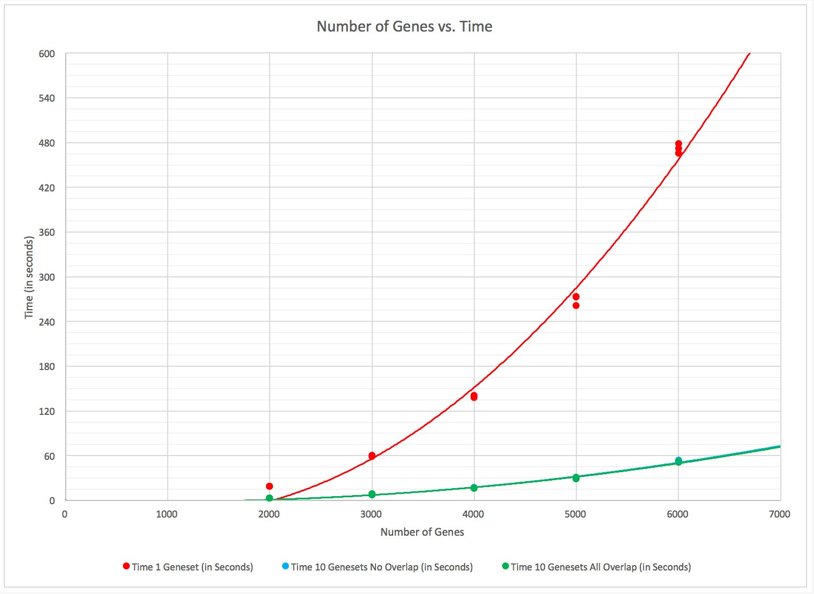

Below is a table that estimates the run time of the red, blue, and green
cases based on number of genes. Note that run times will change based on
density of the gene sets and epsilon.

  Number of Genes|1 Gene Set|10 Gene Sets, No Overlap|10 Gene Sets, Overlap
  :-------------:|:--------:|:----------------------:|:--------------------:
  100|3|3|3
  200|3|3|3
  500|5|3|3
  1,000|10|3|3
  1,500|12|3|3
  2,000|15|3|3
  2,500|28|5|5
  3,000|63|8|8
  3,500|110|12|12
  4,000|160|17|18
  4,500|230|24|25
  5,000|306|32|33
  6,000|487|50|51
  7,000|708|72|75
  8,000|969|98|100
  9,000|1270|129|131
  10,000|1612|163|165

  >Approximate DBSCAN Run Times with Epsilon = 1 and Min Points = 1 (in
  seconds)

Visualization
-------------

Once DBSCAN is completed, results can be visualized in two ways.
However, there is a possibility that visualization may not occur. If a
data set is too large, the results will not be visualized and a message
will be displayed.

>Note: Due to the rendering of the Cluster / Gene Table, run times may
appear longer than estimated in [here](#run-times-of-dbscan).

### Circles

The default visualization on the tool is circle packing. This represents
the clusters and the genes within them. The outermost circle is the
entire data set. The darker blue circles within represent the different
clusters. The circles within the clusters represent the genes that
belong to the cluster. The color of each gene denotes the species.

To see more information about the cluster, you can click on the cluster.
This will zoom in on the cluster and display gene IDs. Clicking on a
gene ID will redirect to a search for that gene within the GeneWeaver
database.

Below is an example of the circle packing visualization with zoom
functionality.

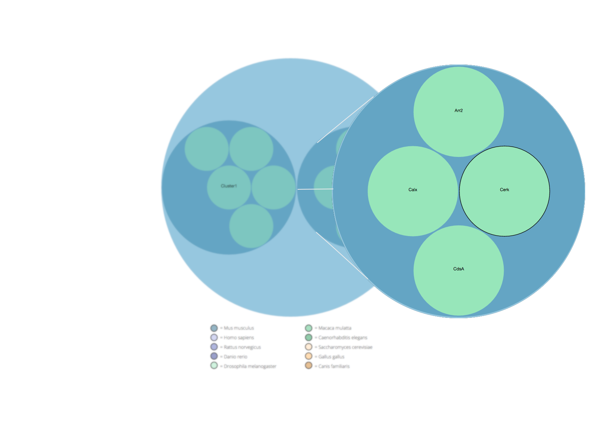

### Wires

The other visualization is a wire representation. This shows the
connections between all genes in the same gene set. The color of each
gene shows which cluster the gene is in. If a gene is grey, it is
considered noise. Mousing over a circle will highlight it and show the
gene ID. By clicking and and holding a gene, you can drag the gene
around the screen.

>Note: This visualization will only be drawn with small data sets due to
the complexity of drawing all lines between genes.

Below is an example of the wires visualization.

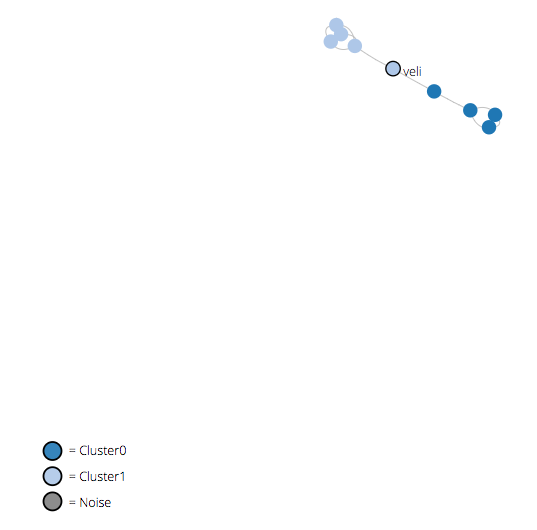

### Cluster / Gene Table

Below the visualizations is a table. This table is split up into
clusters, which contains all the genes within that specific cluster.
Information about each gene can be seen here as well. This table is
similar to the one on the **GeneSet Details** page.

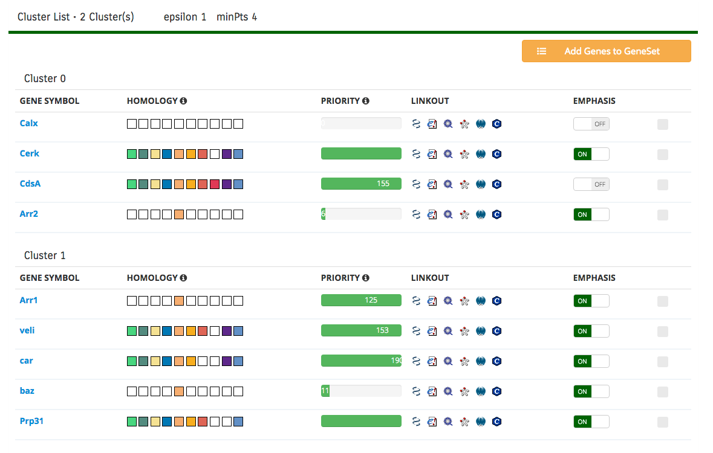

If the data set becomes sufficiently large, a minimized table will be
shown on screen. An example of the minimized table is below.

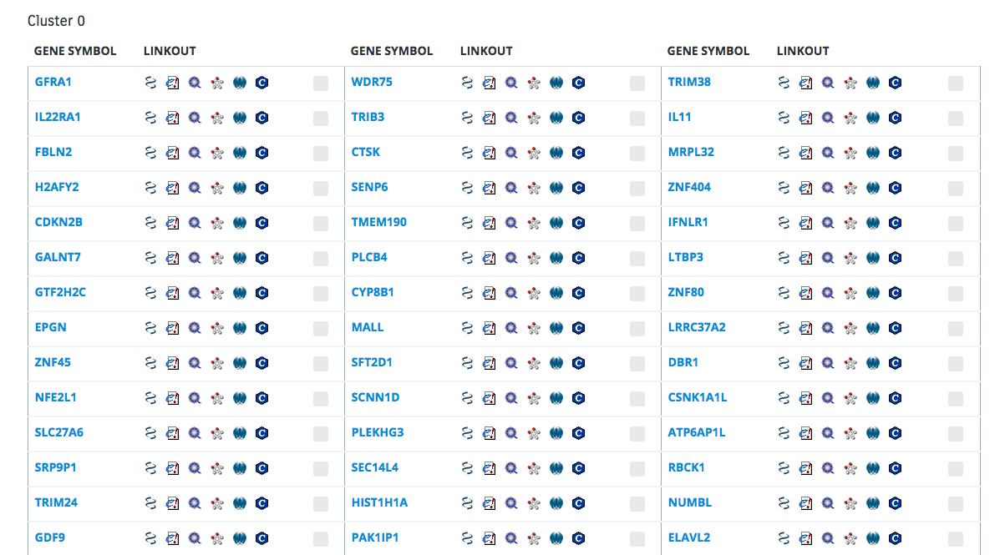

DBSCAN Example
--------------

Below is an example of the DBSCAN algorithm. For this example, epsilon
is set to 1 and min-points is set to 4. Figure 1 shows the gene-to-gene
set bipartite graph.

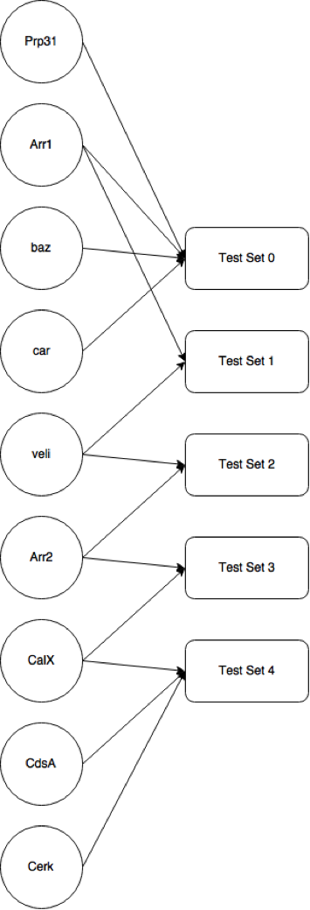

_Figure 1_: The gene-to-gene set bipartite graph

### Finding Shortest Paths Between Genes

Starting at "Test Set 0" Prp31, Arr1, baz, and car are all in the same
gene set. This means that when building the gene-to-gene graph, all of
those genes will be connected to each other. "Test Set 1" shows that
Arr1 and veli are connected. "Test Set 2"has veli and Arr2 connected.
"Test Set 3" has Arr2 connected to CalX. Finally, "Test Set 4" has CalX,
CdsA, and Cerk connected. Now that the connections between genes are
determined, a map can be drawn showing these connections (Figure 2).

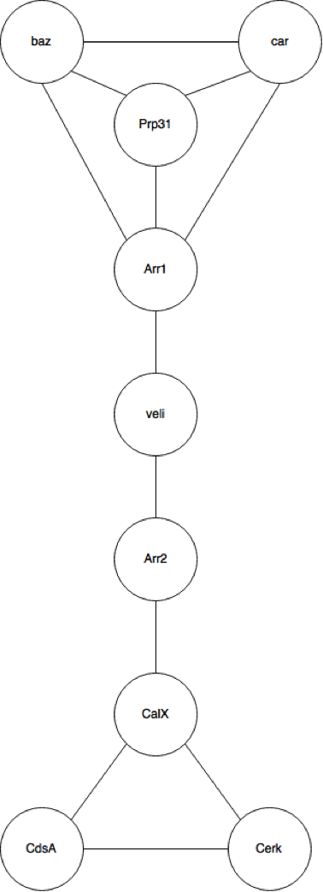

_Figure 2_: The gene-to-gene graph denoting shortest paths

Using this graph, the shortest path from a gene to any other gene can be
determined. For example, the distance between Arr1 and baz is 1. The
distance between Prp31 and CalX is 4. This is important when applying
epsilon to the algorithm.

### Running the DBSCAN Algorithm

This is the pseudocode for the algorithm.

Starting in the DBSCAN function, the cluster is first initialized to 0.
Next, each point is visited only once. For this example, baz will be the
first gene visited. baz will be first be marked as visited, then the
neighbors of baz will be found by regionQuery. The regionQuery function
will return all points within radius epsilon, including the point
itself. Calling regionQuery on baz with epsilon will return all genes
that are one away from baz. In this example baz, car, Prp31, and Arr1
are returned and listed as baz's neighbors.

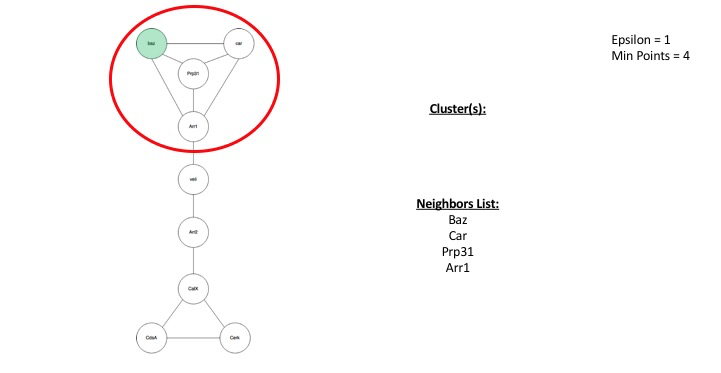

The list of \[baz, car, Prp31, Arr1\] are returned. Now the amount of
items in the list is checked with the minPoints parameter. If it is
greater than or equal to minPoints, a cluster is formed. Otherwise, the
point is labelled as noise. In this example, baz has 4 neighbors, which
is equal to the number of points. The "C = next cluster" statement means
that C is a valid cluster. Next, the expandCluster function is called.

The expandCluster will continue to expand the cluster until the edge of
the cluster is reached. The edge of a cluster is reached when a point
has a list of neighbors that is less than the number of minPoints. When
entering the expandCluster function, the point P will be added to the
cluster. The cluster is currently \[baz\]. Next, the algorithm runs
through all of the neighbors to see if the cluster can be expanded. The
list of neighbor points is now \[baz, car, Prp31, Arr1\]. First baz is
looked at, but because it has already been visited, it is not going to
be checked again. Next, car is checked. Car will then return a list of
all its neighbors, which are \[car, baz, Prp31, Arr1\]. Then that list
is checked against the number of minPoints. Since it is greater than or
equal to minPoints, that list is added to the original list of
neighbors. So the original neighbors list of \[baz, car, Prp31, Arr1\]
and the new neighbors list of \[car, baz, Prp31, Arr1\] are added
together. However, the algorithm does not add duplicate genes to the
list. Therefore, nothing is added to the list and the neighbors list is
\[baz, car, Prp31, Arr1\]. Then, the gene is added to the current
cluster if it is not already part of a cluster. car is not a part of any
other cluster so it is added to the current cluster. Now the cluster
contains \[baz, car\].

Next, Prp31 is looked at. Its neighbors are \[baz, car, Prp31, Arr1\].
This list is equal to minPoints, but once again, the list of Prp31's
neighbors are already in the list of baz's neighbors. So nothing is
added to new neighbors, and since Prp31 is not a part of any other
cluster, it is added to the current cluster, which is now \[baz, car,
Prp31\].

Now, Arr1 is looked at. Its neighbors are \[Arr1, baz, car, Prp31,
veli\]. Notice that a new gene appeared in Arr1's neighbors (veli). This
gene is now added to the list of baz's neighbors. Arr1 is added to the
current cluster, so the cluster now holds \[baz, car, Prp31, Arr1\]. Now
there is still one gene left to check in baz's neighbors, which is veli.

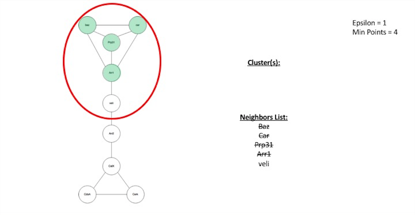

veli is checked and it's neighbors are \[veli, Arr1, Arr2\]. The list is
less than the number of minPoints, which means the cluster cannot be
expanded past veli.

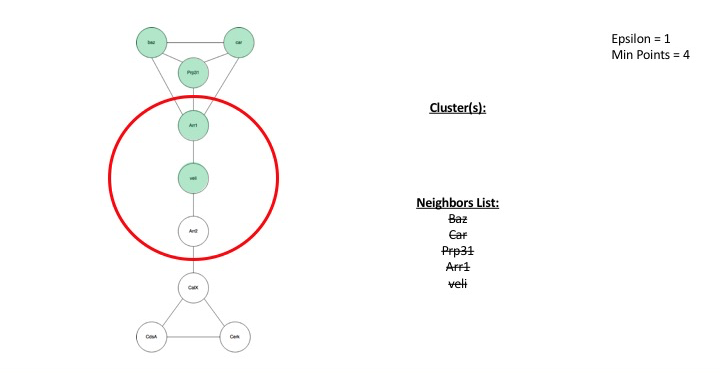

However, veli is still part of the current cluster. The current cluster
is now \[baz, car, Prp31, Arr1, veli\]. Since the list of baz's
neighbors have all been checked, the cluster is finished.

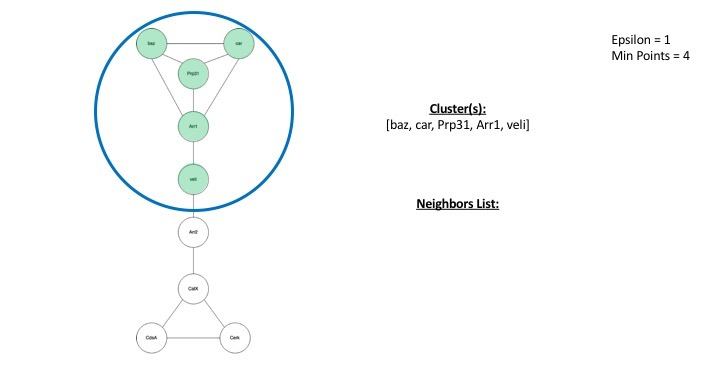

Now that baz has been checked, it is time to check other genes. Next,
car is checked. However, it was already visited when handling baz's
neighbors, so nothing needs to be checked. The same applies for Prp31,
Arr1, and veli. The next gene to check is Arr2. Arr2's neighbors are
\[veli, Arr2, CalX\]. This is less than minPoints, so it is marked as
noise.

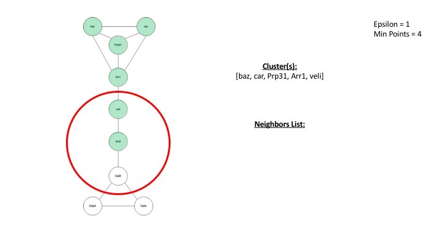

However, just because a gene is marked is noise, does not guarantee it
is noise when the algorithm is finished. Later in the algorithm, it can
be added to a cluster.

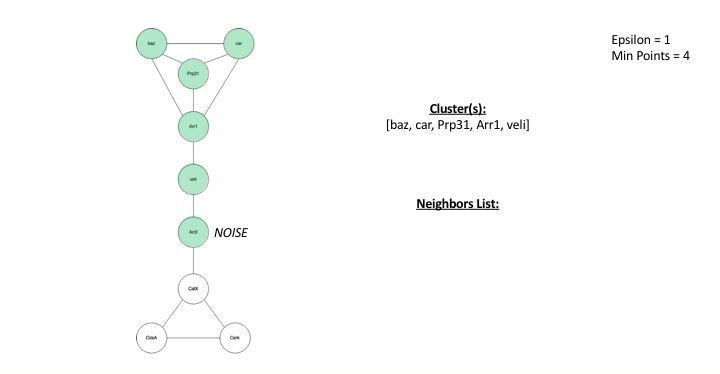

Next, CalX is checked. It's neighbors are \[CalX, Arr2, CdsA, Cerk\].
This list is equal to minPoints, so the cluster needs to be expanded.

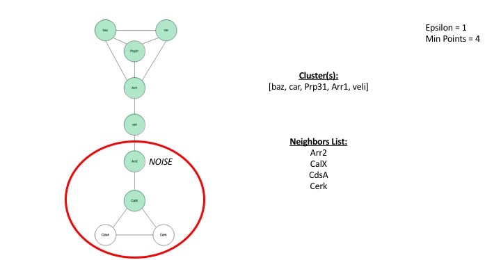

CalX is checked, but it is already visited, and it is not a part of any
cluster, so it is added to the 2^nd^ cluster. The 2^nd^ cluster
currently holds \[CalX\]. Next, Arr2 is checked, but it was already
visited and marked as noise. However, it is not in any cluster, so it is
added to the 2^nd^ cluster. The 2^nd^ cluster now contains \[CalX,
Arr2\]. Next, CdsA is checked. Its neighbors are \[CdsA, Cerk, CalX\].
This list is not greater than minPoints so nothing is added. CdsA is not
added to the 2^nd^ cluster because it is not part of the first cluster.
The 2^nd^ cluster is now \[CalX, Arr2, CdsA\]. Finally, Cerk is checked.
Its neighbors are \[CdsA, CalX\]. The list is smaller than minPoints, so
they are not added to Calx's neighbors. Cerk is not a part of any
cluster, so it is added to the 2^nd^ cluster. The 2^nd^ cluster is now
complete. It contains \[CalX, Arr2, CdsA, Cerk\].

Now that CalX is checked, CdsA is checked. It was already visited in the
expandCluster function so nothing needs to be done. The same applies for
Cerk. The algorithm is now complete.

Two clusters were produced: \[baz, car, Prp31, Arr1, Veli\] and \[Arr2,
CalX, CdsA, Cerk\]

Figure 3 shows the gene-to-gene map visualized in clusters.

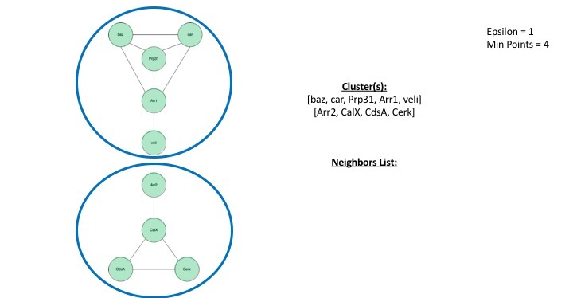

_Figure 3_: The result of the DBSCAN clustering
