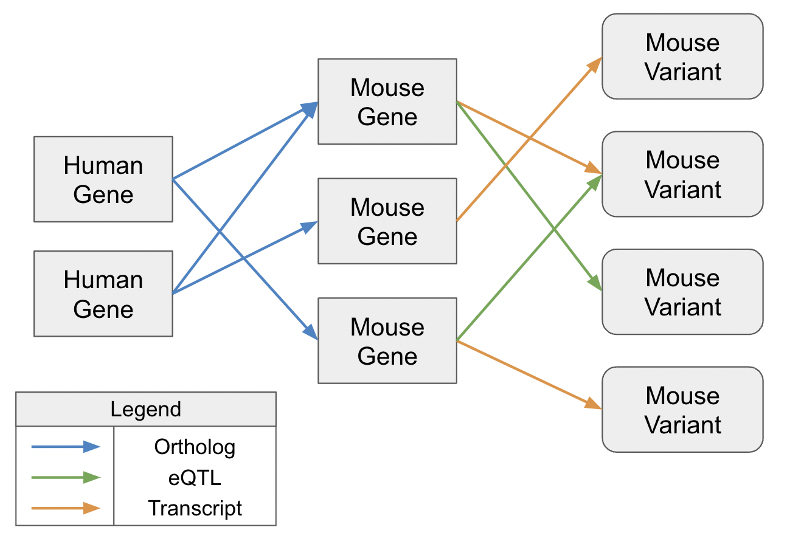

**Find Variants**
======================

Why Use the Find Variants Tool
-----------------------------------
The Find Variants tool traverses a graph database representing the relationships of human or mouse variants and genes. The tool starts with a set of human or mouse genes and outputs a list of variants in the other species using orthologous relationships between genes.

The graph database is built off a fixed and reproducible set of data sourced mostly from Ensembl-104 as well as some other data from JAX, AGR, and GTEx. The data is gathered, processed, and imported into a Neo4J graph database. 

Understanding the Find Variants Tool
-----------------------------------------
If the input to the tool is a list of human genes, the tool would find orthologoous genes in mice and variants of those mouse genes either through eQTL relationships or transcript relationships. The tool can also work from mouse genes to human variants.

_Figure 1_: Cut of the graph database to map the relationships from a set of human genes to mouse variants.

The tool interacts with the a graph database built using information from AGR and Ensembl for information about genes and their orthologous relationships.

Using the Find Variants Tool
---------------------------------
Access the Find Variants Tool through the [Analyze Genesets](index.md#analyze-gene-sets-tab) tab.

To generate variants, you must first select GeneSets from a project. Projects may be created and updated by uploading GeneSets, searching the GeneWeaver database, or through the use of other tools in the GeneWeaver system. See the documentation for [uploading GeneSets](#uploading-gene-sets), [Search](#searching-geneweaver), or [Manage GeneSets](#gene-set-utilities) to learn more about these functions. To select an entire project or multiple projects for analysis, check the box next to the project name. To select individual GeneSets within a project, click on the **+** beside the project name and check individual GeneSets using the check boxes. Next, click on the Jaccard Similarity icon in the Analysis tools box to the left of the project list.

You must select at least one GeneSet to be analyzed. All GeneSets selected must be from the same species, either mouse or human.

Once you have selected GeneSets from a project, select the **Find Variants** icon from the Analysis Tools box, to the left of your GeneSets.

After the tool has finished, a results table is displayed containing information about the variants found. The results can be searched for keywords using the searchbar and all the results can be downloaded using the 'Download' button which will create a CSV file titled 'FindVariants_*.csv' where the * is a string of unique numbers.

Options
-------

### Species
Choosing "Human to Mouse" will look for relationships from human genes to mouse variants. Choosing "Mouse to Human" will look for relationships from mouse genes to human variants.

### Path
Choosing "eQTL" will only find variants that are related to genes through the eQTL relationship and will also return the tissue name. Choosing "Transcript" will find variants related to genes through the Transcript relationship and will return a Transcript ID but no information about the tissue name. Selecting both will return variants for both options.

The "Transcript" option will naturally return many more variants than the "eQTL" option and as a result can take much longer to run.
