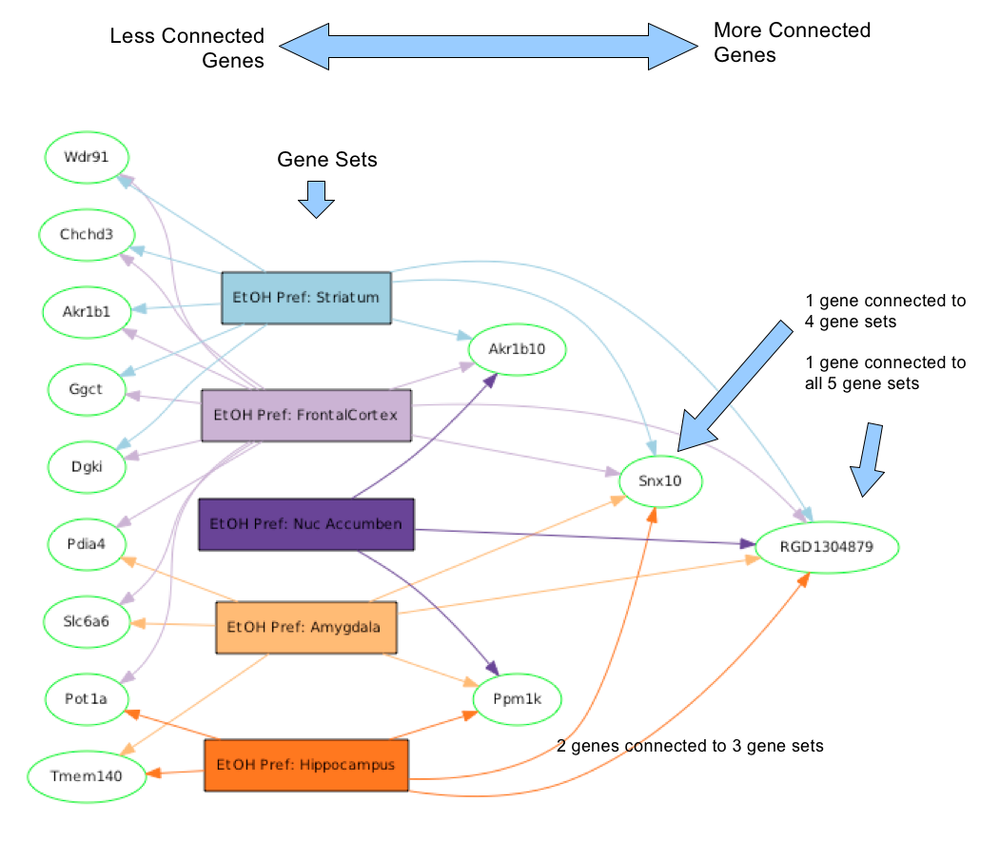
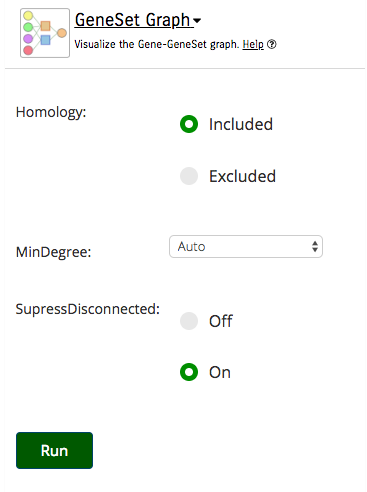
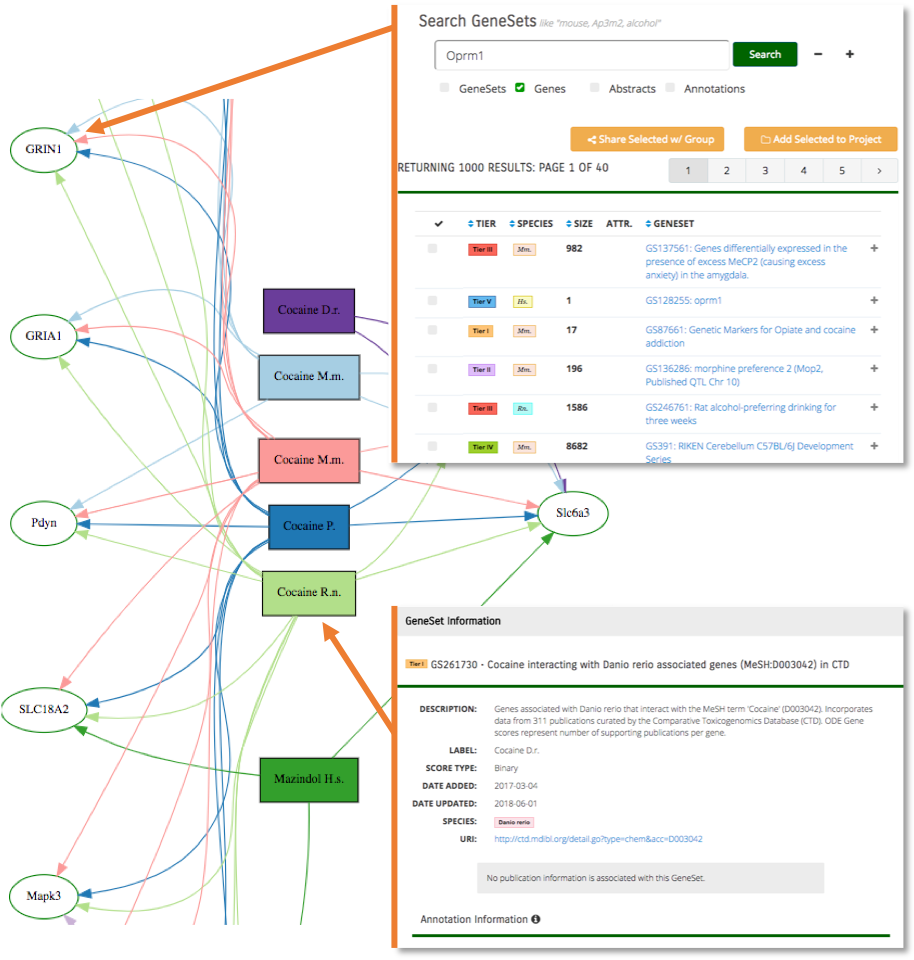
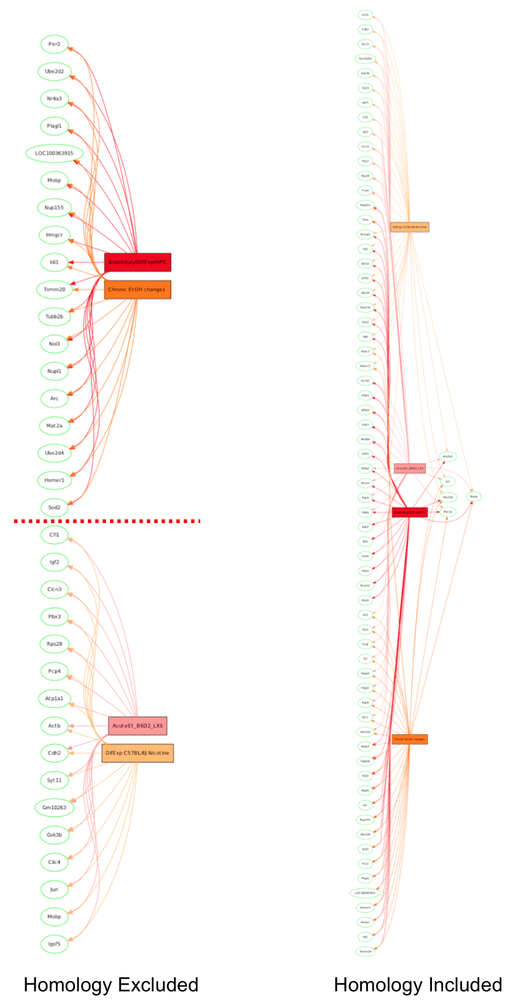
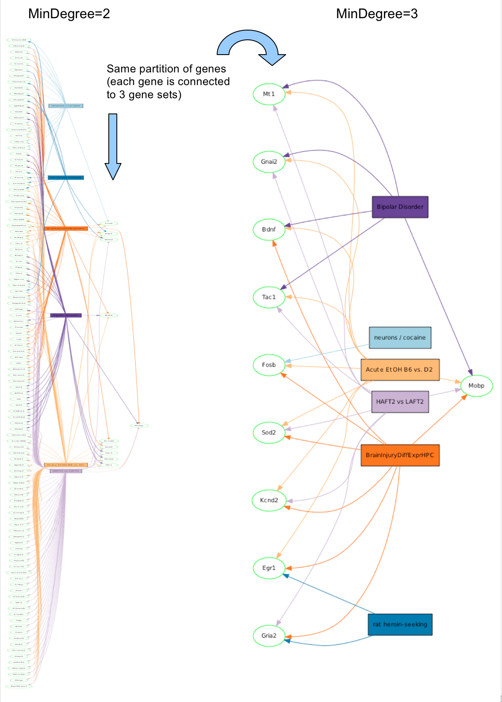

**GeneSet Graph**
=================

Why Use the GeneSet Graph Tool
------------------------------

The GeneSet Graph is designed for the user in need of a partitioned display to illustrate just how tied genes are to one another. For example: a user in need of a GeneSet Graph would look for visual references more than chemical references or references by utility. A GeneSet Graph can also help pick apart the most valuable or most occurring genes depending on the user's preference.

Understanding the GeneSet Graph Tool
------------------------------------

The GeneSet Graph Tool presents a partitioned display of genes and GeneSets. Genes are represented by elliptical nodes, and GeneSets are represented by boxes. The least-connected genes are displayed on the left, followed by the GeneSets, then the more-connected genes in increasing order to the right. Genes and GeneSets are connected by colored lines to show what genes are in which GeneSets. In this way, the GeneSet Graph displays the bipartite graph of the genes and GeneSets, but modifies the display of the gene partition to make it easier to visually interpret.

_Figure 1_: Least connected genes to the left, GeneSets in the middle, most connected genes on the right.

### Using the GeneSet Graph Tool

Access the GeneSet Graph Tool through the [Analyze Genesets](index.md#analyze-gene-sets-tab) tab.

To generate a GeneSet Graph, you must first select gene sets from a project. Projects may be created and updated by uploading GeneSets, searching the GeneWeaver database, or through the use of other tools in the GeneWeaver system. See the documentation for [uploading GeneSets](#uploading-gene-sets), [Search](#searching-geneweaver), or [Manage GeneSets](#gene-set-utilities) to learn more about these functions. To select an entire project or multiple projects for analysis, check the box next to the project name. To select individual GeneSets within a project, click on the **+** beside the project name and check individual GeneSets using the checkboxes. Next, click on the GeneSet Graph icon in the Analysis tools box to the left of the project list. (For users that want to change options, press the green **+** sign before they start the tool).

_Figure 2_: GeneSet Graph Selectino Icon.

The GeneSet Graph can be interactively panned and zoomed with the mouse, and more details of each gene or GeneSet can be viewed by clicking on the individual nodes in the display. In addition to these interactive features, there are also a few options available to optimize the display.

Clicking on a gene node executes a search for other GeneSets containing the gene of interest or its homologues. Clicking on a GeneSet node reveals full publication and annotation information, including the GeneSet description.

_Figure 3_: Selecting GeneSets will navigate users to the GeneSet page; selecting the gene will initiate a search of that gene.

Options
-------

### Suppress Disconnected

When enabled, this option will suppress the display of GeneSets which are not connected to any displayed genes. This helps remove unnecessary information for users that only want relations. This is only relevant when [MinDegree](#mindegree) is greater than 1.

### Homology

Include homology to integrate multi-species data. If excluded, data from multiple species will be segregated into distinctly separate graphs.

_Figure 4_: 2 GeneSets each from mouse and rat.

### MinDegree

The minimum number of connections for a displayed gene. A value of 2 means that any displayed genes must be found in at least two of the input gene sets. Increasing this value will basically shift the resulting gene display left. Since lower-order overlaps are generally more likely and more numerous than higher-order intersections, this can quickly reduce the number of genes displayed and make the result more manageable.

_Figure 5_
