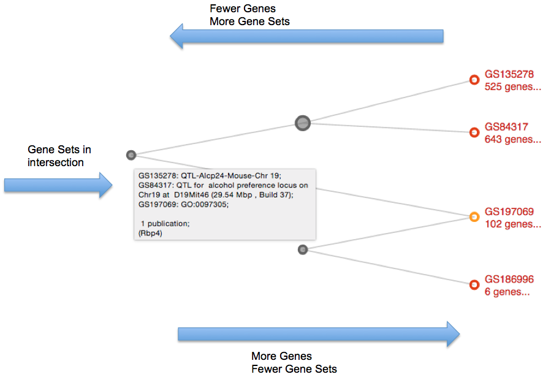
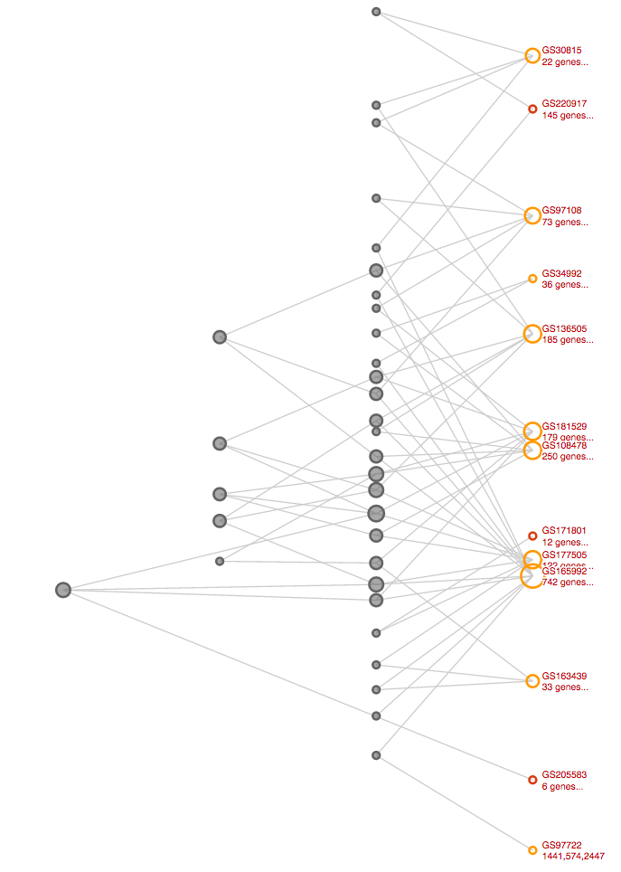
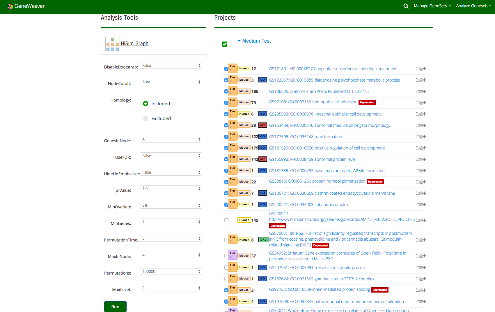
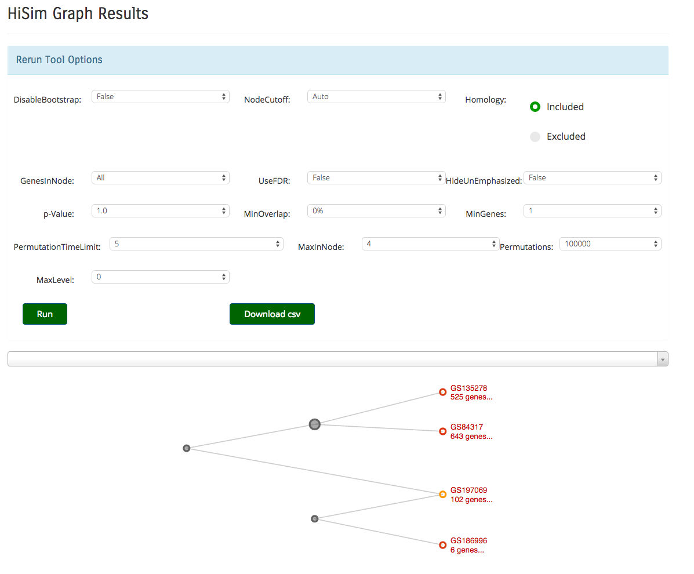
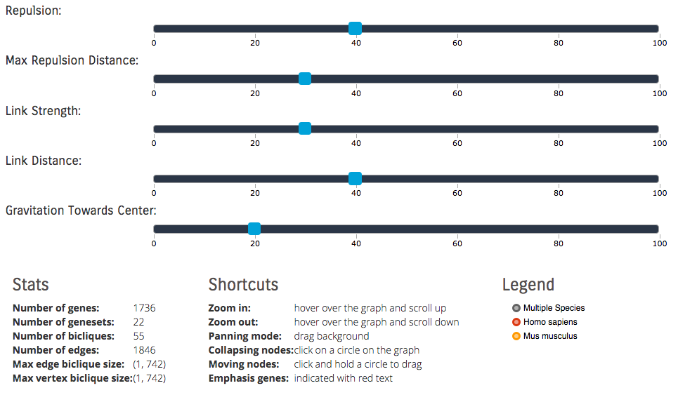
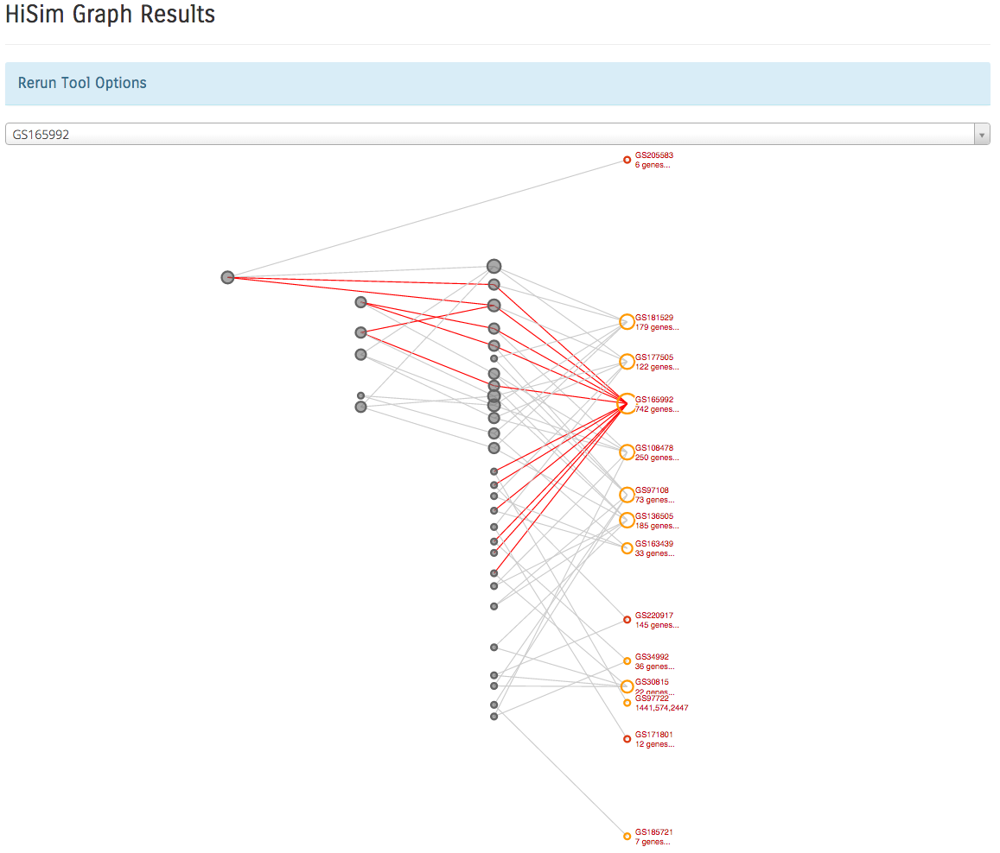
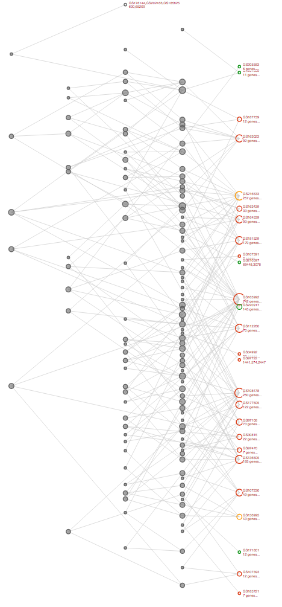
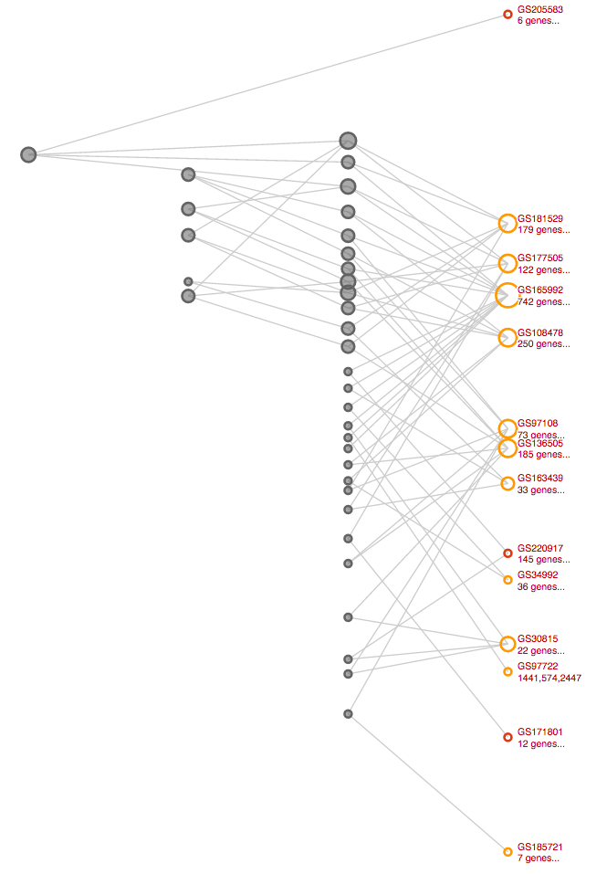
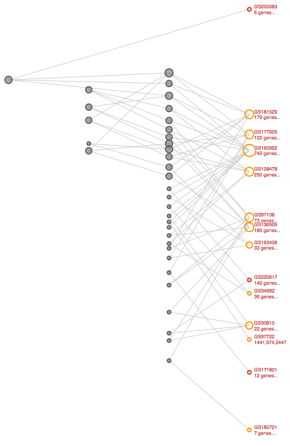
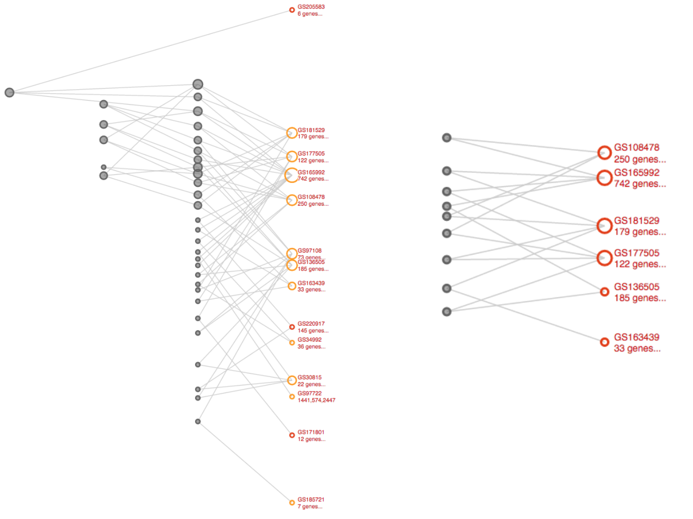

**HiSim Graph**
===============

About the HiSim Graph Tool
--------------------------
The HiSim Graph, short for Hierarchical Similarity Graph, is a tool for grouping
functional genomic datasets based on the genes they contain. _For example_: The user may
want to determine what a set of experiments on alcohol preference have in common, and
what makes various experiments unique from one another. Alternatively, one may wish to
take a large set of studies of related phenomena and identify their shared or distinct
substrates. In this situation one may want to know whether there is a shared biological
basis for addiction and learning, and if so, what the substrate is. The user might also
want to examine studies of a large number of related disorders and determine whether a
more appropriate biologically-based classification can be constructed.

The HiSim Graph Tool is designed to address these goals; it presents a tree of
hierarchical relationships for a set of input GeneSets. The structure is determined
solely from the gene overlaps of every combination of GeneSets.

Understanding the Results of the HiSim Graph
--------------------------------------------

It's best to use the HiSim Graph Tool with knowledge on what set intersections are: If
GeneSet A contains Gene A, Gene B, and Gene C, and also GeneSet B contains Gene A, Gene
B, and Gene D. Then the intersection of GeneSet A and GeneSet B will contain Gene A and
Gene B, because an intersection of sets are whatever is contained in all sets
intersected.

In terms of GeneSets, the smallest intersections (fewest GeneSets, most genes) are
towards the right, and the largest intersections (most GeneSets, fewest genes) are on
the left. When thinking about the genes in all the GeneSets, the roles are reversed (
smallest number of genes on the left, largest number of genes on the right).

_Figure 1_: Relation of GeneSets to the HiSim Graph

HiSim Graphs must be interpreted in the context of the input GeneSets. The above example
represents differentially expressed genes in multiple brain regions of alcohol
preferring rats from a single study. The highest intersection represents a gene
differentially expressed in all 5 brain regions. In this case, the highest intersection
represents the highest amount of correspondence between data sets. As you move to the
right, genes become more specific to the brain regions tested. Each solid node has
children and can be collapsed by clicking on it. Leaf nodes are empty and colored by
species, which is identified in a legend at the bottom of the screen.

_Figure 2_: A HiSIm Graph for diverse functions

If one were to start with multiple alcohol preference measures from different studies,
the top of the HiSim Graph represents the
correspondence between the experiments (such as well-characterized alcohol preference
genes), and as you descend the graph the intersections describe more specific features
shared between experiments (such as stress response or tissue source).

When starting with more loosely related inputs, interpretation becomes more difficult.
If one started with alcohol preference, nicotine dependence, and traumatic brain injury
data (Figure 2), the top of the HiSim Graph would represent more generic processes such
as neural plasticity in this case.

Using the HiSim Graph Tool
--------------------------

Access the HiSim Graph Tool through the [Analyze Genesets](index.md#analyze-gene-sets-tab) tab.

To generate a HiSim Graph, you must first select gene sets from a project. Projects may
be created and updated by uploading GeneSets, searching the GeneWeaver database, or
through the use of other tools in the GeneWeaver system. See the documentation
for [uploading GeneSets](#uploading-gene-sets), [Search](#searching-geneweaver),
or [Manage GeneSets](#gene-set-utilities) to learn more about these functions. To select
an entire project or multiple projects for analysis, check the box next to the project
name. To select individual GeneSets within a project, click on the **+** beside the
project name and check individual GeneSets using the check boxes. Next, click on the
HiSim Graph icon in the Analysis tools box to the left of the project list. Select the
options you would like for the tool to run on, and click Run.

_Figure 3_: Selecting gene sets and executing an analysis from the
Analyze GeneSets page

_Figure 4_: The results page for the HiSim Graph.

Most genes are connected to two of the input GeneSets. One gene is connected to three of
the input sets. (Inset)

### The GeneSet Intersection page

GeneSet intersection data can be downloaded as a csv file for subsequent analyses. The
GeneSets giving rise to each node can be stored in a separate project.

The HiSim Graph opens and the nodes can be selected to expand the graph. More details of
each intersection can be viewed by clicking on the individual nodes in the tree. A link
at the bottom of the frame allows download of the csv.

_Figure 5_: These options are available for the HiSim Graph, to change the way nodes
interact with each other. The stats of the graph, as well as shortcuts and the legend
identifying each species in the graph, are also displayed.

_Figure 6_. This shows the search function, which highlights paths
between nodes containing the item searched for, whether it be gene,
geneset, or species.

Options
-------

There are a number of options available to optimize the HiSim Graph analyses. You may
access the following options on the Analyze GeneSets page by clicking on the HiSim Graph
Tool.

### DisableBootstrap

When the resulting HiSim Graph is unimaginably large, a bootstrapping filter is applied
to reduce the output size. This step removes edges that are weakly supported by the
underlying data, for example, those partitions of GeneSet subgroups that are driven by a
single gene difference between the groups. If you would like the large, unfiltered graph
instead, set this option to True to disable bootstrapping. Be warned this may stretch
the graph's size.

_Figure 6_: A HiSim Graph with DisableBootstrap turned on (True).

_Figure 7_: A HiSim Graph with DisableBootstrap turned off (False).

### Homology

Include homology to integrate multi-species data. This is done by using homologene
mappings to relate identifiers across species. If homology is excluded, data from
multiple species will be segregated into separate trees.

_Figure 8_: Homology excluded. A separate map is drawn for mouse, no overlap with human
is allowed.

_Figure 9_: Homology included. GeneSets from mouse and human are
allowed to be mixed and are intertwined as one.

### MinGenes

The minimum number of genes for an intersection. The default of 1 means that all
intersections will be displayed. Increasing the value means that intersections with
fewer genes will not be displayed in the output, decreasing noise and displaying more
robust correspondence between GeneSets. This generally has the effect of removing the
topmost nodes.

 _Figure 10_:
As shown above, the left tree is with the default MinGenes = 1, the
right tree is with the default MinGenes = 5.

### Permutations

The HiSim Graph can ultimately address questions among highly curated data such as how
much dimension reduction does gene overlap provide. For example, one may take a large
set of gene sets associated with mood disorders and ask whether the data are similar
enough to group together, i.e., of all possible subset intersections, how many are
populated, and is this result better than chance?

The maximum number of permutations to run is set to 0 by default since it can take a
long time to run for large input sets. The genes contained in each GeneSet are permuted
over the union of all genes in the input sets, controlling for the size of each GeneSet.
The permutation tests measure the likelihood of getting a similar tree structure (
Parsimony) or of getting a similar aggregation of genes in each intersection (Gene
Aggregation). Note that this is a maximum value since the actual results may be fewer
due to the [time limit](#permutation-time-limit).

**Parsimony** is a simple measure of the percentage of observed intersections out of all
possible intersections. This is mathematically defined as:

_Figure 11_: For those that aren't aware of the mathematical implications of parsimony,
think of it as one of the many measures of accuracy for a map. You want more parsimony,
but you can't always get full parsimony.

**Gene Aggregation** is a measure of the total node/tree probability. Each node is
scored based on the intersection of genes and gene sets. Then the product of these
scores is used to assign an overall tree aggregation probability:

_Figure 12_: Aggregation is another measure of accuracy that balances with parsimony in
this tool, neither are ever fully accurate alone, but together they are more fine-tuned.

### Permutation Time Limit

The maximum amount of time to spend doing permutations. For example,
if [Permutations](#permutations) is set to 100,000 and this value is 5 minutes, the
result with either have 100,000 permutations (if they finished within 5 minutes), or
will be truncated to the number of permutations which were able to finish within 5
minutes. The more time you give to Permutation Time Limit, the more accurate your
results will be.
