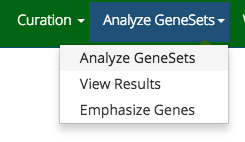
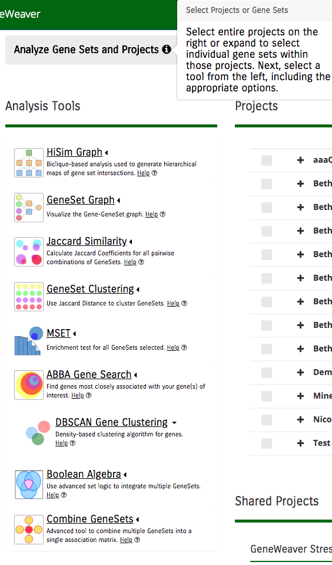
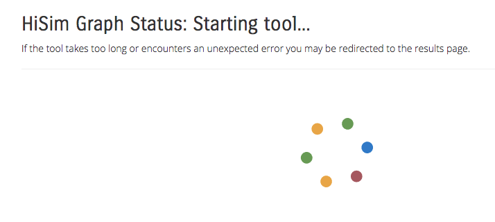
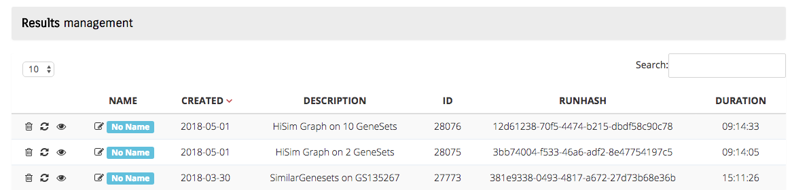

**Analysis Tools**
==================
GeneWeaver uses a set of analysis tools to operate on genes and gene sets. These tools
evaluate a range of data inputs for the purposes of elucidating hierarchical
relationships among a set of gene sets of interest. They can be used to visualize
bipartite clusters, **[HiSim Graph](hisim-graph.md)** or visualize genes with the more
common intersections, **[GeneSet Graph](geneset-graph.md)**.

Generation and visualization of a maximal triclique using the intersection of gene sets
with the **Triclique Viewer Tool** can allow users to discover novel relationships
between gene ontology terms. The overlap/similarity of gene sets themselves can be
visualized with **[Jaccard Similarity](jaccard-similarity.md)** plots. These set overlaps
are also available for **[Clustering](clustering.md)**, while component gene intersections
can be found on our **[Gene Intersection Lists](../reference/geneset-utilities.md#gene-intersection-lists)**. 
The **[Boolean Algebra](boolean-algebra.md)** tool uses advanced set logic to integrate
multiple genesets. For each tool, GeneWeaver allows users to expand their search beyond
a single species using **[Homology Mapping](../reference/geneset-utilities.md#homology-mapping)**.

## Analyze Gene Sets Tab

Use the analyze gene sets tab on the navigation bar to move to the analysis tools.

A registered user or guest user who has a temporary project will see the Analyze page.
Down the left side are all the tools. Select one or more projects or gene sets and click
on the desired tool. Options will then be displayed below the tool. Select the desired
options and click the Run button.

A tool can take a long time, depending on the size and complexity of the selected gene
sets. A message will be displayed showing the progress of the tool. You can now navigate
away from this page and later return to the results page.

## View Results

The link to the results page is on the analyze gene sets tab.

Your tool has completed once the duration column has a time listed. From this page you
can:

* Delete a test that you are no longer interested in
* Re-run a test
* View the test results
* Edit the test name
* Use the Search box to display test name matches
* Sort the columns by clicking on the header
* Select up to 100 results to display per page

