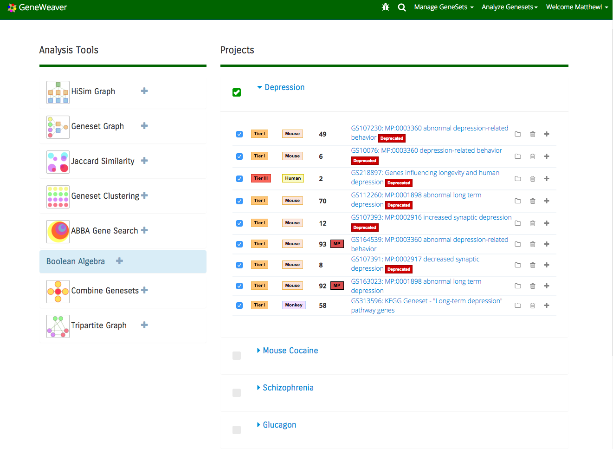
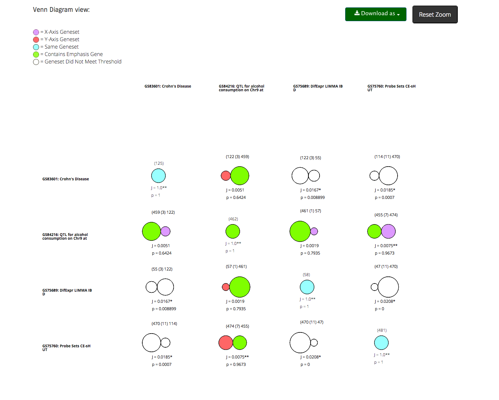
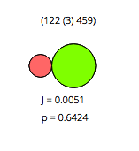
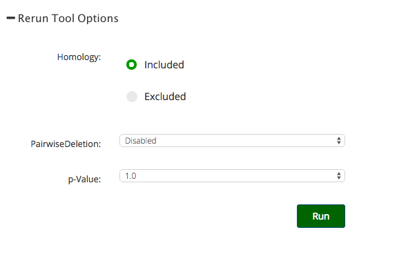
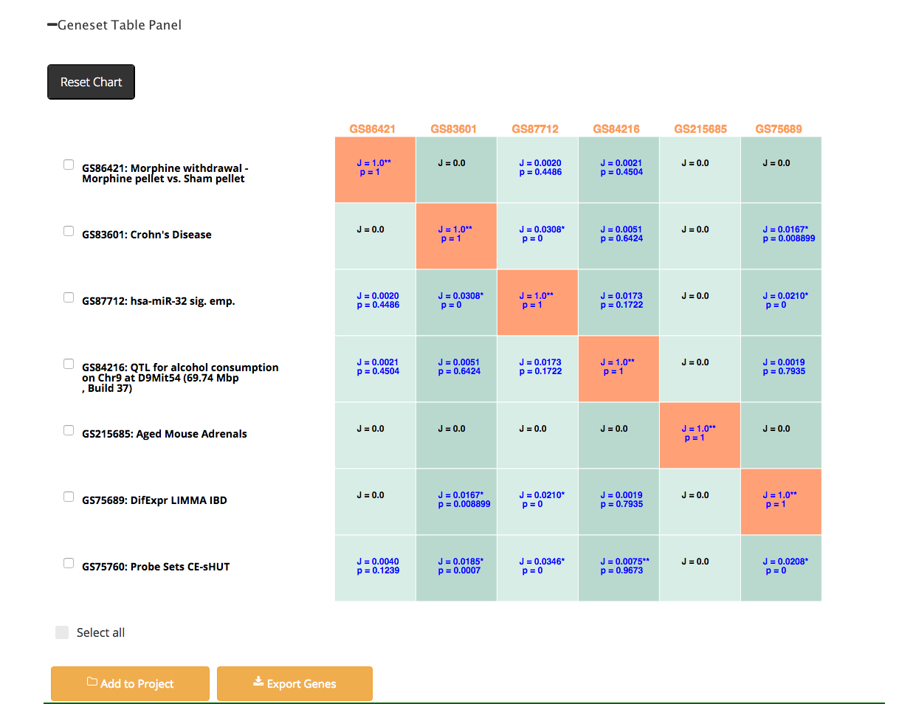

**Jaccard Similarity**
======================

Why Use the Jaccard Similarity Tool
-----------------------------------
The Jaccard Similarity Tool displays a matrix of Venn diagrams, which can be very useful for quickly finding overlapping GeneSets and evaluating the similarity of results across a collection of experiments. This snapshot may enable you to determine which can be removed or kept for more complex comparison analysis (such as the [HiSim Graph](#hisim-graph)).

Understanding the Jaccard Similarity Tool
-----------------------------------------
Each Venn Diagram represents the pairwise gene overlap between the two GeneSets depicted for each row and column. Text overlays show the exact gene counts, Jaccard Similarity coefficient and p-value for every pair. The p-value is calculated based on the cumulative probability of obtaining a Jaccard coefficient greater than or equal to the observed value, using formula \[17\] in Real and Vargas, 1996.

For those less knowledgeable of Jaccard Similarity, it's the ratio of elements in both sets over the elements only found in separate sets. If your matrix produces two separate blue and red circles, rather than a touching Venn Diagram, it means nothing is alike in either of those two GeneSets.

](../assets/images/Jaccard_Similarity_6.png "Jaccard Similarity Equation - source")

### Background Processes
The Jaccard Similarity Tool now implements the calculation of the p-value for the Jaccard Similarity score based on an empirical sampling distribution. The distribution is approximated for each unique gene set cardinality (gene set size) pair. Each unique pair of cardinalities are randomly sampled (10,000 samples) from the actual gene list of the geneweaver database and plotted based on the frequency of Jaccard Similarity. The result is a Frequency versus Jaccard Similarity histogram that is used as the distribution for the calculation of the p-value. To calculate the p-value, the tool will simply compare the Jaccard Similarity of the user-selected gene set and grade it based on the curve stored in the database.

If the Jaccard Similarity does not exist in the curve - that is, if the Similarity is too high to occur *randomly* - the $p$-value is simply zero. If the Jaccard Similarity were to have a value of 1, this would indicate that either one is a subset or both are identical. In this case, we assign a special $p$-value of 1\* since we agree that the probability of a set matching itself (and not some other set which contains other genes) will always occur.

The implementation of this process is coded and optimized for C++ which runs in the background as your results are loading onto the next page.

Using the Jaccard Similarity Tool
---------------------------------
Access the Jaccard Similarity Tool through the [Analyze Genesets](#analyze-gene-sets-tab) tab.

To generate a Jaccard Similarity Matrix, you must first select gene sets from a project. Projects may be created and updated by uploading Gene Sets, searching the GeneWeaver database, or through the use of other tools in the GeneWeaver system. See the documentation for [uploading GeneSets](#uploading-gene-sets), [Search](#searching-geneweaver), or [Manage GeneSets](#gene-set-utilities) to learn more about these functions. To select an entire project or multiple projects for analysis, check the box next to the project name. To select individual GeneSets within a project, click on the **+** beside the project name and check individual gene sets using the check boxes. Next, click on the Jaccard Similarity icon in the Analysis tools box to the left of the project list.

_Figure 1_: Once you have selected GeneSets from a project, select the **Jaccard Similarity** icon from the Analysis Tools box, to the left of your GeneSets.

Tool results are displayed as a grid of proportional overlaps. The grid, itself, is written in d3 for dynamic user interaction.

_Figure 3_: Venn diagram for 9 GeneSets. The detail below highlights Column 3, Row 2.

Jaccard Overlap       |                                          |
:--------------------:|:----------------------------------------:|
| GS row = pink circle (left)  GS column = green circle (right) J = Jaccard coefficient p = $p$-value Green circles show emphasis genes|

The resulting matrix can be zoomed in and out by scrolling the mouse up and down. There is a reset zoom button just in case the user's place is lost in the matrix of venn diagrams. The user can also click and, in addition to these interactive features, the gene sets can be highlighted by row and column by _shift+clicking_ on the intersection of two gene sets.

The gene sets can be deselected by alt+clicking on any highlighted gene set.

### Rerun Option

The user is able to rerun the tool with different parameters with the rerun tool options.

_Figure 7_: Rerun tool option

This option is expandable/collapsable by simply clicking on the Rerun Tool Options text.

### Geneset Panel

The geneset panel shows the Jaccard coefficients and the p-values for every geneset pair for the project the user has chosen. The geneset panel does not recieve the same reduction as the venn diagram as it would be helpful to still view every geneset pairing for convenience.

The user may also click the checkboxes located next to the geneset names for them to add those selected genesets to a project or to export the genes.

_Figure 2_: Click *Run* to produce Jaccard Similarity Results for your selected GeneSets. Text overlays show the exact gene counts, Jaccard Similarity coefficient and p-value for every pair.

Options
-------

### Homology
Include homology in order to integrate multi-species data. If excluded, homologous genes from different species will not be counted as intersecting. Data from separate species will never show an overlap without homology.

### PairwiseDeletion
[Pairwise Deletion](http://www-01.ibm.com/support/docview.wss?uid=swg21475199) is used to pick off problematic missing values from data while still aiming to get the remaining values for comparison-based use:

Values|Obj1|Obj2|Obj3
:----:|:--:|:--:|:--:
Length|23|N/A|13
Width|21|22|14
Depth|N/A|20|11

_Figure 7_: In Pairwise Deletion, when comparing length, only Obj1 and Obj3 will be compared. When comparing width, all will be compared, and when comparing depth, only Obj2 and Obj3 will be compared. This prevents missing data from being assigned a default value such as 0 in the system.
