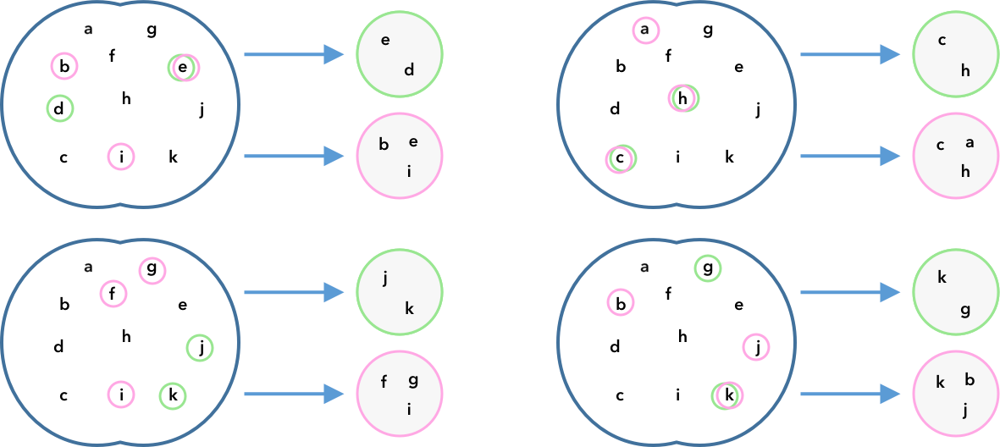
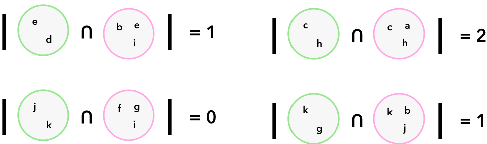
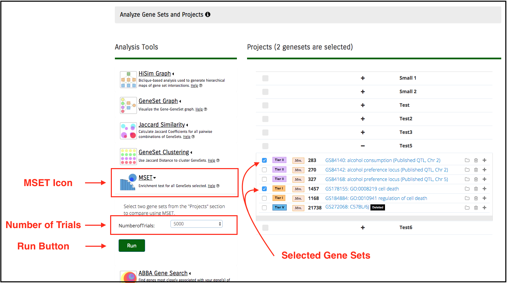
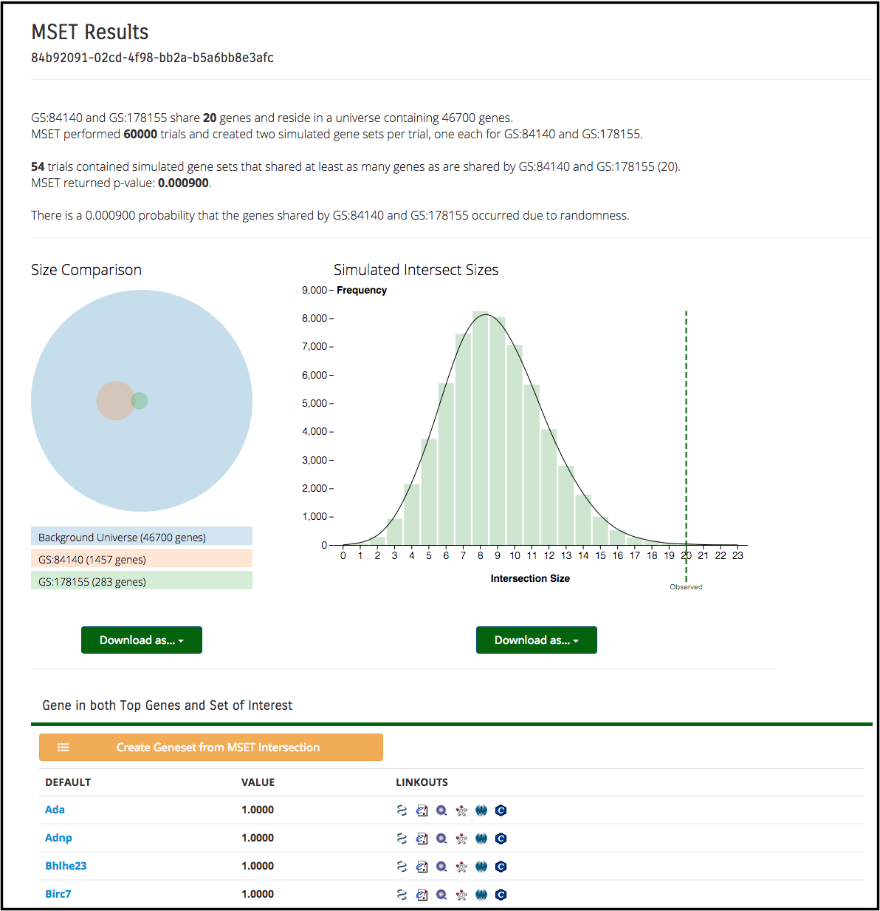

**MSET**
========
Modular single-set enrichment tool (MSET): randomization-based test for list over- or under-representation

About MSET
----------

MSET was developed to compare gene lists. From four character lists (gene_list1, gene_list2, background1, background2), it
computes a randomization-based p-value describing the likelihood that the intersect of **gene_list1** and **gene_list2**
is underexpressed or overexpressed relative to randomness alone.

MSET is based on work from
[Eisinger et al., 2013, "Development of a versatile enrichment analysis tool reveals 
associations between the maternal brain and mental health disorders, including autism." BMC Neuroscience](https://www.ncbi.nlm.nih.gov/pmc/articles/PMC3840590/).

Why MSET?
---------

MSET permits the selection, or customization, of the genes against which enrichment is performed. This yields the 
ability to perform more focused hypothesis testing relative to other enrichment tests. For example, genes specific to 
Alzheimer's may be selected to serve as the genes of interest against which enrichment testing is performed.

How Does MSET Work?
-------------------

MSET performs enrichment testing using several entities:

**User Selected**:

*  **Gene Set 1**: The first set of genes to perform MSET on
*  **Gene Set 2**: The second set of genes to perform MSET on
*  **Number of Trials**: The number of simulated sets to create

**MSET Computed**:

*  **Gene Set 1 Background**: Determined from Gene ID Type and Species of Gene Set 1
*  **Gene Set 2 Background**: Determined from Gene ID Type and Species of Gene Set 2
*  **The Universe**: The intersection of **Gene Set 1 Background** and **Gene Set 2 Background**
*  **Gene Set 1-U**: Genes in **Gene Set 1** that are also contained in the **The Universe**
*  **Gene Set 2-U**: Genes in **Gene Set 2** that are also contained in the **The Universe**

MSET then takes the following steps:

1.  First, the computed inputs are calculated,
2.  Then, MSET calculates the v
    (said another way, it counts the number of shared genes)
3.  For the **Number of Trials**, MSET then samples randomly without replacement from **The Universe** to generate two simulated gene sets of sizes **Gene Set 1-U** and **Gene Set 2-U** respectively,
    -  For each trial, the intersection of the two simulated gene sets is recorded
4.  MSET then calculates the p-value as:

### An Example

The example below illustrates MSET with four trials.

Given the following:

- Two gene sets, e.g. GS001001 and GS001002

- A background for both GS001001 and GS001002 (we can call them B001001 and B001002, respectively)
    - Geneweaver determines this automatically by inspecting the gene ID type and species of each gene set

- The number of trials MSET should perform (in this case, four)

1. First, MSET defines _The Universe_ as the intersection of B001001 and B001002.

2. Any genes in GS001001 or GS001002 that aren't in _The Universe_ are discarded from the analysis. GS001001 and GS001002 now only contain those genes that also exist in _The Universe_.

3. MSET then calculates the cardinality of the intersection of GS001001 and GS001002. Let's assume that GS001001 and GS001002 only share the gene j, then the intersect size is determined to be 1. Here we show simulated GS001001 set in green, and simulated GS001002 sets in pink. Genes which have been selected for either simulated set are circled in their set's color.

4. MSET then samples randomly without replacement to create four simulated sets each of GS001001 and GS001002. Here we assume that GS001001 has size 2, and GS001002 has size 3.

5. From the simulated gene sets above, MSET calculates the size of the intersect of each simulated set of GS001001 and GS001002. 

6. MSET calculates a p-value using this formula:

We performed four trials, three of which had samples with an intersection at least as large as our observed gene sets. So MSET would return a p-value of 3/4, or 0.75.

Using MSET
----------

Access the MSET Tool through the [Analyze
Genesets](#analyze-gene-sets-tab) tab.

To analyze your genes, select two gene sets. You will often have organized these sets into a project relevant to your work. Projects may be created and updated by uploading GeneSets, searching the GeneWeaver database, or through the use of other tools in the GeneWeaver system. See the documentation for [uploading GeneSets](#uploading-gene-sets), [Search](#searching-geneweaver), or [Manage GeneSets](#gene-set-utilities) to learn more about these functions. MSET can only accept two gene sets as input, so you can only use the whole-project select box if your project only contains two sets.

Next, click on the MSET icon in the Analysis tools box to the left of the project list and specify how many trials you'd like MSET to perform. Once you're ready click the run button.

 

Once the tool has completed the analysis you will be directed to the results page. There you can view the distribution graph of all simulated intersect sizes, an accurate size comparison graph of the selected sets and the background, and the genes shared by the two input sets. You can download both graphs for later use, and you can also create a new gene set from the genes shared by your two input sets. 

 
