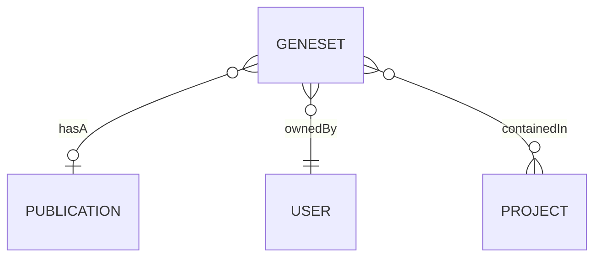
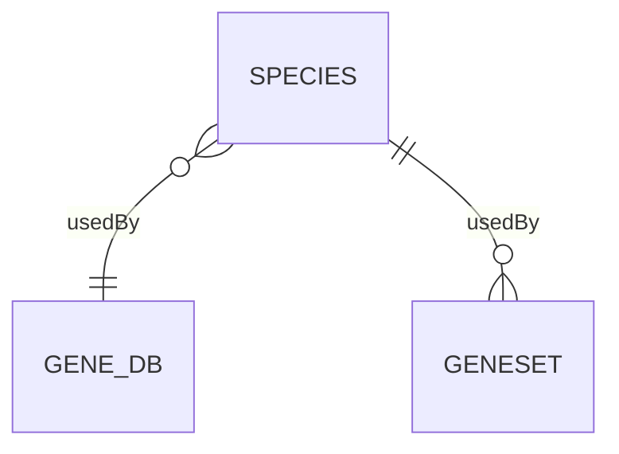
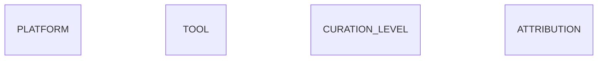
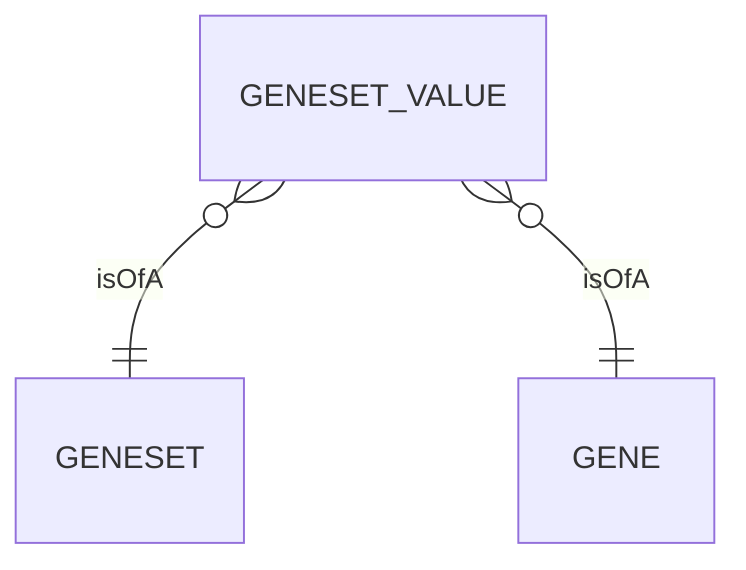

GeneWeaver utilizes a relational normalized data model to store both user data, and
external sources data. The [database](https://en.wikipedia.org/wiki/Database) is 
designed to be flexible and extensible, and to allow for the addition of new data types 
and analysis tools without requiring changes to the data model.

On a high level the data model uses three 
[schemas](https://en.wikipedia.org/wiki/Database_schema) to organize the types of data
that are stored in the database. The schemas are:

- `production`: Geneweaver Data
- `odestatic`: Static Data
- `extsrc`: External Sources

This page discusses the concepts and structure of the data model in detail, but is not 
intended to be used as a reference for the database and data model. For example, this 
page does not use the actual database table and column names, but instead uses full 
descriptive name of the entities and their relationships.

!!! tip
    For a complete reference of the Geneweaver data model, see the 
    [data model](../../reference/data-model) reference page. 

## Production Schema
The production schema is the primary schema used to store user data. The schema's 
central entity is the `geneset` 🧬+📂. The schema contains tables & relationships for
user data, but external source and static data relationships utilize tables in the
`odestatic` and `extsrc` schemas.

## ODEStatic Schema

## Extsrc Schema
The `extsrc` schema contains tables for external sources data, this is where the 
magic 🪄 happens. 

