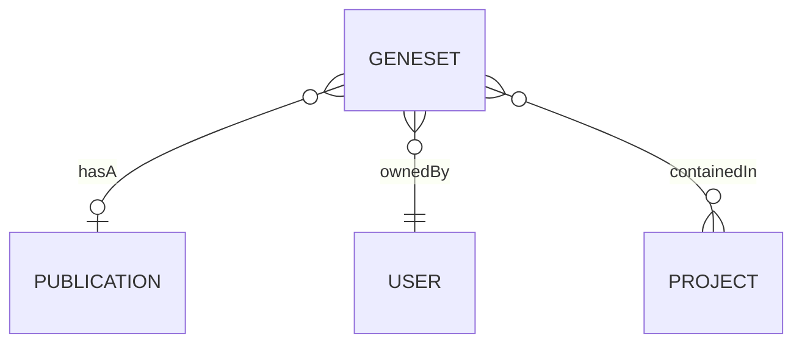
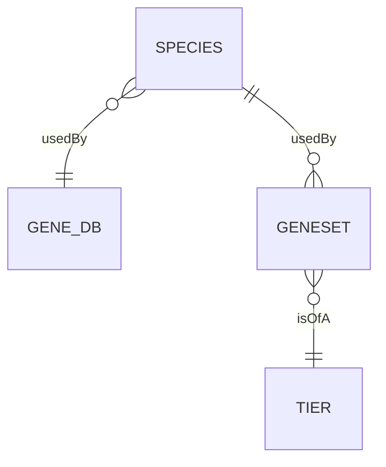
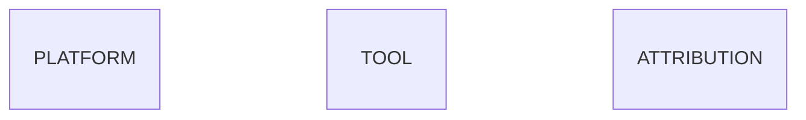
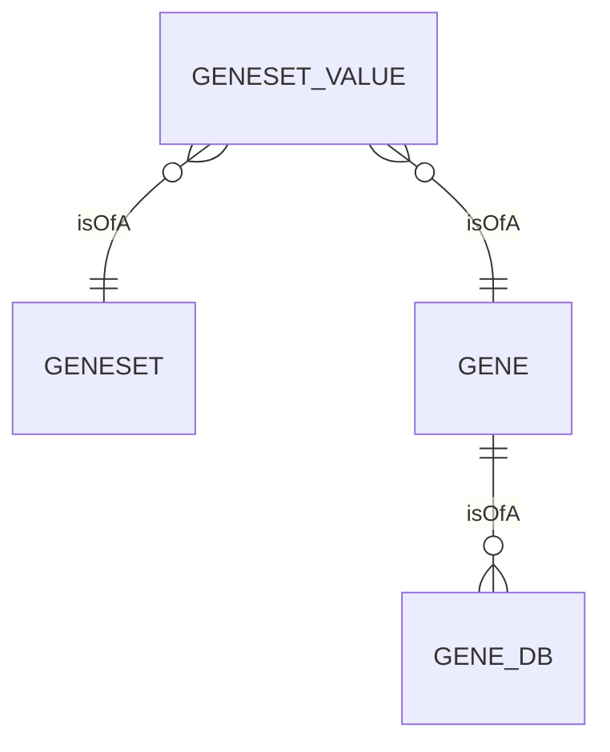

GeneWeaver utilizes a relational normalized data model to store both user data, and
external sources data. The [database](https://en.wikipedia.org/wiki/Database) is 
designed to be flexible and extensible, and to allow for the addition of new data types 
and analysis tools without requiring changes to the data model.

On a high level the data model uses three 
[schemas](https://en.wikipedia.org/wiki/Database_schema) to organize the types of data
that are stored in the database. The schemas are:

- `production`: Geneweaver Application Data
- `odestatic`: Static Data
- `extsrc`: External Sources Data

This page discusses the concepts and structure of the data model in detail, but is not 
intended to be used as a reference for the database and data model. For example, this 
page does not use the actual database table and column names, but instead uses full 
descriptive name of the entities and their relationships.

!!! tip
    For a complete reference of the Geneweaver data model, see the 
    [data model](/reference/data-model) reference page. 

## Production Schema
The `production` schema is the primary schema used to store user data. The schema's 
central entity is the `geneset` 🧬+📂. The schema contains tables & relationships for
user data, but external source and static data relationships utilize tables in the
`odestatic` and `extsrc` schemas.

## ODEStatic Schema
The `odestatic` schema contains tables for static data, such as species, gene databases,
and geneset tier. The schema is used to store data that is not expected to change, and
is used to provide a reference for the `production` schema.

The following diagram shows how the `geneset` 🧬+📂 entity is related to the `odestatic`
schema entities: `species` and `tier`.

The `odestatic` schema also contains tables that are used for internal tracking
and configuration. Above, the `gene_db` entity for the `platform`, `tool`, and 
`attribution` entities. These entities are used internally by the system to track
information about enabled analysis tools, microarray expression platforms, and data 
sources.

## Extsrc Schema
The `extsrc` schema contains tables for external sources data, this is where the 
magic 🪄 happens. 

Fundamentally, the gene 🧬 to geneset 🧬+📂 association is a many-to-many association.
A geneset can contain many genes, and a gene can be associated with many genesets. To 
represent this relationship, the association is stored in an 
[associative table](https://en.wikipedia.org/wiki/Associative_entity), which we call 
`geneset_value`.

The `gene` entity is a 
[polymorphic](https://en.wikipedia.org/wiki/Polymorphism_(computer_science)) entity that
can be associated with multiple external sources, which are represented by the `gene_db`
entity.

The following diagram shows how the `geneset` 🧬+📂 entity is related to the `extsrc`
schema entities: `geneset_value`, `gene`, and `gene_db`.

!!! danger "Microarray Expression Data"
    Geneweaver also supports microarray expression data. Due to its complexity, this 
    document does not cover the data model that supports this feature.

    For more information on microarray expression data, see the
    [Data Model](/reference/data-model) reference page.