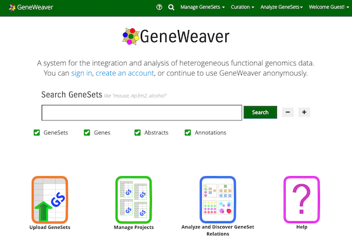

# Web Application

## Introduction
The [Geneweaver web application](https://geneweaver.org) in a fully integrated platform 
for the integration and analysis of heterogeneous functional genomics data. It is 
designed to be a one-stop-shop for researchers looking to integrate and analyze complex 
datasets in order to gain new insights into biological processes and pathways.

Users of the [web application](https://geneweaver.org) users can benefit from a more 
streamlined workflow, reduced learning curve, and improved collaboration and data 
sharing capabilities. They can also benefit from the convenience of having all of their 
tools and data accessible from a single, web-based interface, which can be accessed from
any device with an internet connection.

[{ align=left, loading=lazy }](https://geneweaver.org)

Users that do not anticipate using the web application will still benefit from an 
understanding of the concepts in this page. Fundamentally, all components of the 
GeneWeaver ecosystem were designed and created to support the development the web 
application.

## Basic Workflow
A basic workflow for a user of the web application is as follows:

!!! note "Step 1: Upload GeneSets / Search for GeneSets"
    A user needs to either upload their own data, or search for (and find) data that
    they are interested in using the GeneSet search tool.

!!! abstract "Step 2: Create Projects / View Projects & Tools"
    In order to analyze GeneSets, they need to be added to a project. So a user
    needs to either create a new project, or select an existing project to add
    GeneSets to.

!!! example "Step 3: Analyze"
    Once a user has added GeneSets to a project, they can then analyze the data
    using the tools available to them on the "Analyze GeneSets" page.

!!! question "Step 4: Interpret & Annotate Results"
    Once a user has analyzed their data, they can then interpret and annotate the
    results using the tools available to them on the "View Results" page.

!!! success "Step 5: User Groups & Sharing Data"
    Once a user has analyzed their data, they can then share their results with
    other users by adding them to a user group.

## Continued Exploration

=== "Researchers 🔬"
    To learn more, you can either jump right in and head over to the
    [GeneWeaver Web Application](https://geneweaver.org){ .md-button }

    Or you can read the extensive documentation that is specific to the web application:
    [Geneweaver Web Application Documentation](https://geneweaver.org/help/){ .md-button }

=== "Educators & Students 📚"
    [//]: # (TODO)
    !!! warning "Work in Progress"
        To learn more, you can either jump right in and head over to the

        [GeneWeaver Web Application](https://geneweaver.org){ .md-button }

        Or you can read the extensive documentation that is specific to the web application:
        [Geneweaver Web Application Documentation](https://geneweaver.org/help/){ .md-button }

=== "Software Developers 💻"
    [//]: # (TODO)
    !!! warning "Work in Progress"
        To learn more, you can either jump right in and head over to the

        [GeneWeaver Web Application](https://geneweaver.org){ .md-button }

        Or you can read the extensive documentation that is specific to the web application:
        [Geneweaver Web Application Documentation](https://geneweaver.org/help/){ .md-button }

