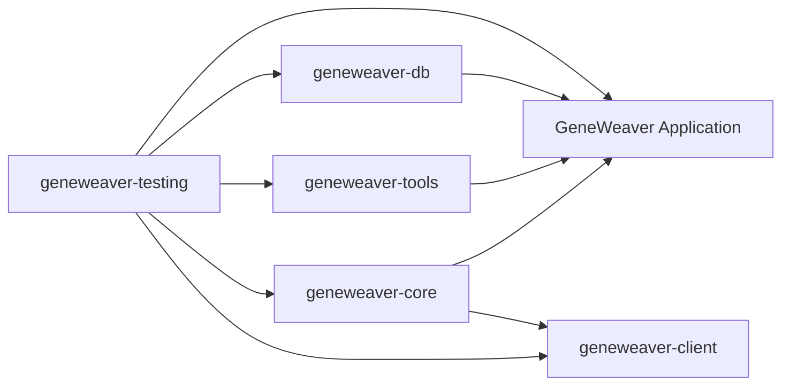
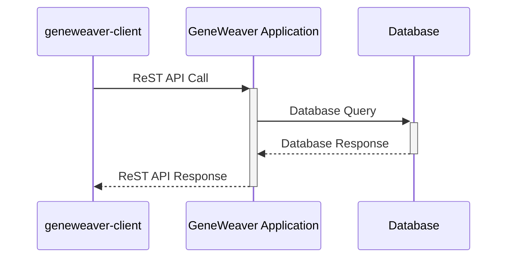

GeneWeaver is a collection of python packages that are used to build the GeneWeaver web 
application. 

These packages are also available for use in other projects. The packages are:

- [`geneweaver-core`](https://pypi.org/project/geneweaver-core/): 
Foundational shared functionality for the GeneWeaver project.
- [`geneweaver-client`](https://pypi.org/project/geneweaver-client/): 
A command line interface interacting with GeneWeaver ReST APIs.
- [`geneweaver-testing`](https://pypi.org/project/geneweaver-testing/): 
GeneWeaver's shared automated tests.
- [`geneweaver-tools`](https://pypi.org/project/geneweaver-tools/):
A framework for creating analysis tools for the GeneWeaver project.
- [`geneweaver-db`](https://pypi.org/project/jax-geneweaver-db/): 
A package for interacting with the GeneWeaver database.

Each package has its own documentation and code repository, which can be found in the 
links above.

## Package Relationships

The following diagram shows the relationships between the packages.



The client consumes the ReST APIs provided by the GeneWeaver application. 


## Next Steps
=== "Researchers 🔬"
    Researchers should consider using the GeneWeaver web application to upload and 
    analyze their data. The web application is available at 
    [geneweaver.org](https://geneweaver.org).

    Sometimes, it might be useful to use the command line interface to automate the
    uploading or downloading of data to/from the web application. This can be done
    using the python package called 
    [`geneweaver-client`](https://pypi.org/project/geneweaver-client/), which can
    either be installed directly
    ```
    pip install geneweaver-client
    ```
    or into a virtual environment
    ```
    python -m venv my-venv
    source my-venv/bin/activate
    pip install geneweaver-client
    ```
    
=== "Educators & Students 📚"
    [//]: # (TODO)
    !!! note "Coming Soon"
        Documentation for educators and students is coming soon.

=== "Software Developers 💻"
    [//]: # (TODO)
    !!! note "Coming Soon"
        Documentation for software developers is coming soon.
