# **Curation Guide**

The Curation menu in GeneWeaver provides options for managing curation tasks and
searching and assigning publications

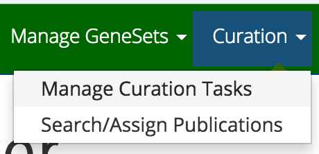

**Managing Curation Tasks**

When selecting “Manage Curation Tasks” from the navigation menu you’ll be presented with
a page containing in the side bar, all of the curation groups you belong to separated by
groups you administer and groups of
which you are just a member. The main body of the page will contain the list of curation
tasks for the selected group in the side bar. The curation tasks are a mix of
publications and genesets, which have been assigned
to this group, with the tasks, which have not yet been assigned to a curator, appearing
at the top of the table.

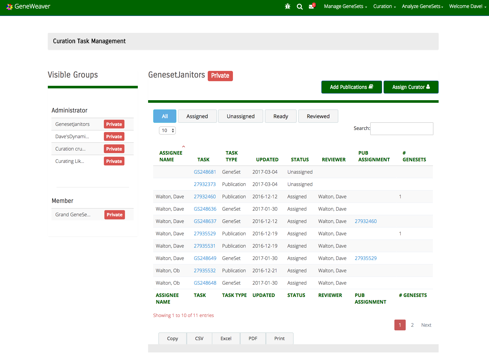

You can change the selected group in the main part of the page just by clicking on the
group of interest in the side bar.

Immediately above the table, there are buttons which will allow you to filter the
contents of the table to contain: **All** results, **Assigned** tasks, **Unassigned**
tasks, tasks which are **Ready** for
review and tasks which have been **Reviewed**. In this context _Assigned_ and
_Unassigned_ are referring to curator assignment.

The columns of the table are mostly self-explanatory, however it’s worth explaining PUB
ASSIGNMENT and \# GENESETS.

The PUB ASSIGNMENT column will display the associated PubMed ID for a geneset task, when
it was entered via an association when a **Publication Assignment**. The link on the
PubMed ID will take you to the publication assignments page.

The \# GENESETS column indicates for a publication, how many genesets are associated
with it as part of this specific publication assignment. If this publication is assigned
to another curation group as well, genesets as part of that publication Assignment will
not be part of this number.

If you are an administrator of the curation group for which you are
managing tasks, there should also be an **Assign Curator** button at the top right of
the page. You are able to select one or more task rows in the table, at which point they
should be highlighted yellow.

One note about how row selection works: There are no _**Shift**_ or
_**Control**_ operations for selecting multiple rows. Rows are selected one at a time,
and remain selected until you click on the row again, when it becomes deselected. Also,
selections do not persist when you move to the next page of results. This latter issue
is something we intend to address in a future release. However, for the time being it’s
recommended you select the visible rows you would like to assign, assign them, and then
move onto the next page of results.

Once you’ve chosen the tasks you want to assign (or reassign), you will select the
Assign Curator button.

You will then be presented with a modal dialog box, where you can select the individual
you wish to curate the tasks, and include a note regarding the curation assignment.

Once a curator has been selected, click the **Assign For Curation**
button. If you select **Close** instead no assignment will be made.

For your convenience, if you realized while in the Curation Task
Management page that you want to assign a publication to this group, so that you can
subsequently assign it to a curator, there is also an _**Add Publication**_ button at
the top of the page.

This button will take you to the **Search/Assign Publications** page with only
publication generators listed that were created for the curation group.

**Search/Assign Publications**

When selecting “Search/Assign Publications” from the page menu you’ll be presented with
a page containing an “accordion” display, with the middle section opened by default. The
assumption is that most times the user will be interested in generating a list of
publications from which to make assignments.

The section is broken into 3 parts:

1. Single Publication Assignment
2. Publication Generators
3. Generated Publication Listing

**Single Publication Assignment**

If you select the **+** symbol next to _Single Publication Assignment_ you will be
presented with a simple search box. This would be used in the case where you have a
specific PubMed ID that you know and want to assign for curation. You simply enter the
PubMed ID and select the **Find Publication** button.

Assuming you’ve entered a valid PubMed ID, the citation will be returned so that you can
confirm that this is indeed your publication of interest.

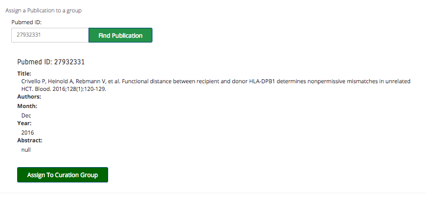

To assign the publication to a curation group to work on, just select the Assign To
Curation Group button and you will be presented with the following modal dialog box
displaying a drop down so you can select the curation group and a text box so that you
can enter any curation notes you might have.

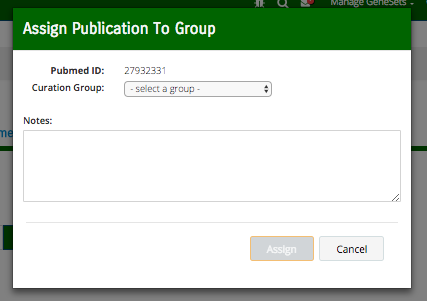

**Publication Generation**

If you select the **+** symbol next to _Publication Generators_ you
will be presented with a table of generators that have been created for groups of which
you are a member, and an **Add Generator** button.

The columns of the table represent: the NAME that was assigned to the generator when it
was queried; the PUBMED SEARCH term that is used to search PubMed and bring back a list
of publications; FOR GROUP which is the curation group for which the generator was
created; the date the generator was LAST RUN; and a series of ACTIONS which can be
executed on a generator (will discuss these later).

In the case where there are no generators already created for any of the groups to which
you belong, the first step would be to click **Add Generator**. This will bring up a
modal dialog box

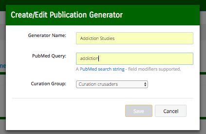

You will be presented with three fields, which are all mandatory in
order to have the **Save** button enabled. Generator Name is a self
selected name to represent your generator. PubMed Query must be a valid PubMed search
term. You can learn more about valid PubMed terms using the following YouTube video
([<https://www.youtube.com/watch?v=dncRQ1cobdc&feature=relmfu>](https://www.youtube.com/watch?v=dncRQ1cobdc&feature=relmfu)).
There is also a link to the PubMed search string builder
([<https://www.ncbi.nlm.nih.gov/pubmed/advanced>](https://www.ncbi.nlm.nih.gov/pubmed/advanced))
directly in the dialog box.

Once created the generator becomes available in the table of generators.

**Generator Actions**

There are three actions available to be used with generators:

-  Run
-  Edit
-  Delete

We’ll discuss Run last as it’s most involved and leads to the next
section.

Edit is fairly straight forward. It presents you
with a modal dialog identical to the one you get when creating a new generator. You are
able to update any of name, search term or group association.

 Delete will simply bring up a confirmation dialog
box.

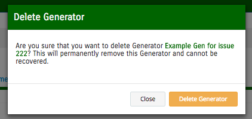

 Lastly the Run option will cause the generator to
run against PubMed, automatically collapse the **Publication Generators** accordion
section and will expand the **Generated Publication Listing** section, with the results
of the generator displayed.

**Generated Publication Listing**

If you select the **+** symbol next to _Generated Publication Listing_ you will be
presented with a table of publications that have been pulled from PubMed and are the
result of the PubMed search term associated with a given generator. This section is
populated by selecting the Run  icon in the
generator table.

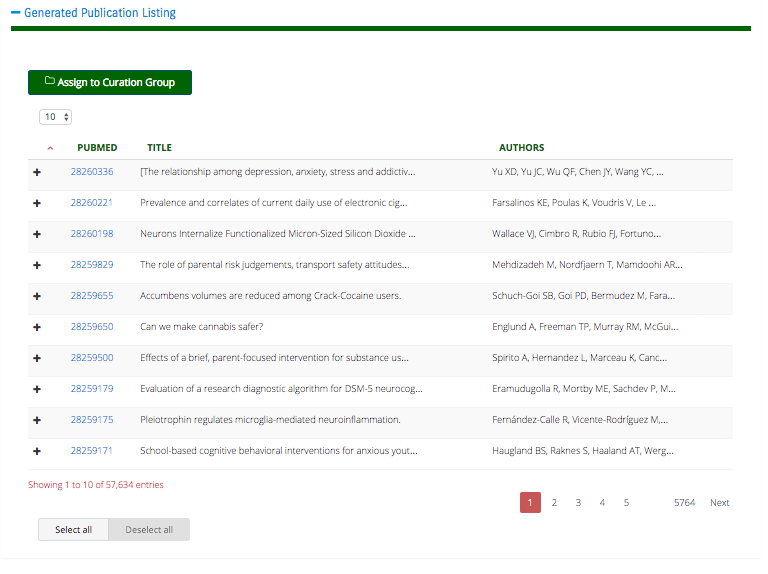

Publications that are pulled by a publication generator are not
persisted in the GeneWeaver database. At least, not until the time they are assigned to
a curation group. Instead the publications that are not already assigned to a group are
pulled directly from PubMed at the time of generation. Some of these queries can result
in a very large number of publications (hundreds of thousands). Therefore we only
display a slice of the publications at a time. We do keep track of the total number that
match the search term, and allow you to page through the results, each time going back
out to PubMed to pull in the next set.

Similar to the Curation Task Management page, you can select multiple rows to be
assigned to a curation group all at once. This is done by individually selecting each
publication of interest. There are no features for multi select all at once using either
the control or shift keys. The only way you can de-select a row, is by clicking the row
again.

You can get more detail about a publication by clicking the **+** symbol at the
beginning of the row. This will display the title, authors, journal and publication
date, a link to the full text of the publication and the abstract.

Once you’ve selected the publication or publications that you would like to assign to a
curation group, you select the **Assign to Curation Group** button. This will bring up a
modal dialog box where you will select a curation group, and optionally type in a note
regarding the curation that is to be done.

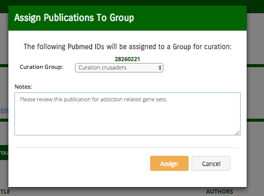

Once assigned the publications that have been assigned to a curation group should now
have a View icon appearing at the end of the row, and if you cursor over the icon you
will see a tool tip telling you what group or groups are curating this publication.

Also, if you select the **+** symbol at the beginning of the row now, the groups will be
listed under **Assigned to Curation Groups** under the expanded details.

Once an assignment has been done a notification will be sent to the
administrator of the curation group so they know that there is a new publication that
needs to be assigned to a curator. Notifications will be discussed in another section.
If you now return the the **Manage Curation Tasks** page for the curation group to which
the publication has been assigned, you should now see the publication listed at the top
of the tasks table.

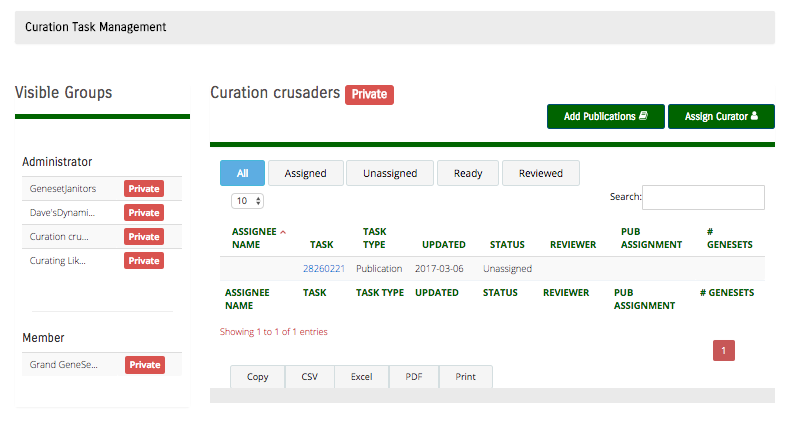

**Publication Curation Assignment**

You can get to the _**Publication Curation Assignment**_ page from the **Curation Task
Management** page in one of two ways.

- Click on the PubMed ID in the TASK column of a publication row of the task table.
- Click on the PubMed ID in the PUB ASSIGNMENT column of a geneset row of the task
  table.

If you select a publication that has not been assigned to a curator yet, you’ll get to a
page that looks something like this:

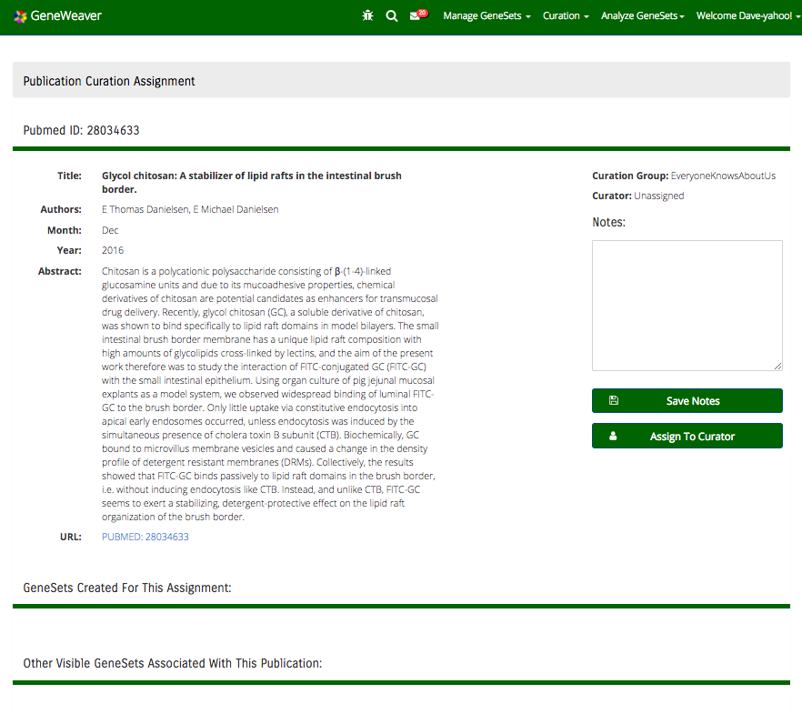

The citation information is present, and the curation group is
identified, but there is no curator assigned and no associated genesets.

Assignment to a curator could have been done via the **Curation Task Management** page
as detailed previously, or by using the **Assign To Curator** button on this page. The
functionality of that button is essentially the same as on the other page, with an
option to select a curator, and include a curation note.

Once the curator is assigned, the curator’s name and any notes that have been entered
will appear in the upper right hand side of the page.

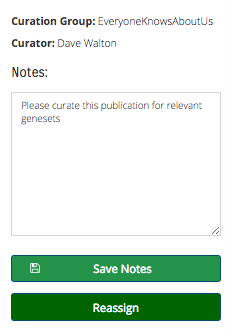

As the assignee of a publication, you will be presented with an
additional button below **Save Notes** to be used to **Create New
Geneset**. The **Reassign** button that was visible to the administrator now becomes a *
*Mark as Complete** button.

Clicking on the Create New Geneset button brings up a dialog that allows you to enter a
“stub” for one or more new genesets. A stub is essentially a placeholder for a geneset
that will be more completely populated at a later time. This gives a curator the ability
to quickly create a bunch of stubs while reviewing an article without having to enter
the full information for each.

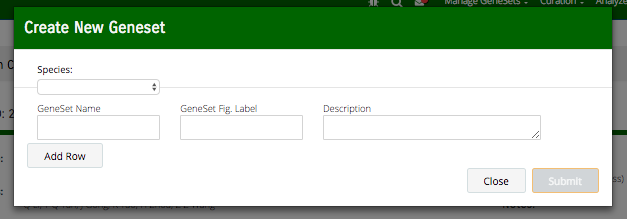

The curator can select the species of interest and then just enter the name, the label
to be used in figures and a description. They can add multiple for this species by
selecting **Add Row**, and when they’ve entered the information for all the geneset
stubs associated with this species, they hit **Submit**.

When you’ve hit Submit, some automatic annotation of the geneset happens in the
background. Your geneset stub will not immediately become visible under **GeneSets
Created For This Assignment**. Instead you will see “loading…”. Once the geneset stubs
are created the page will display the new geneset stubs.

Once it’s loaded the geneset stub will appear under **GeneSets Created For This
Assignment**. It might take a while for the new geneset stub(s) to appear in the list of
genesets associated with the publication assignment, since GeneWeaver is calling out to
an external text annotator to annotate the geneset description and publication abstract.

If there are other genesets visible to the user that are associated with this
publication, but were not created through this publication assignment, then they will
show up under **Other Visible GeneSets Associated With This Publication**.

Once the geneset stubs have been created, the curator can click on the link for any one
of the genesets, and begin curation of an actual geneset.

When curation of all of the associated genesets for this publication are complete, the
curator should click the **Mark as Complete** button on the **Publication Curation
Assignment** page.

#### Curation Page

The geneset curation page is essentially the standard _**view geneset details**_ page
with some of the features turned off. On this page the curator can add or remove genes
from the geneset, set a threshold, edit meta content, or update the curation notes. Once
the curator has finished editing the geneset they can mark is **Ready for Review**,
which will send the geneset back to the group administrator for review. If the group has
multiple administrators then the geneset will be sent to the administrator that assigned
the curation task to the curator.

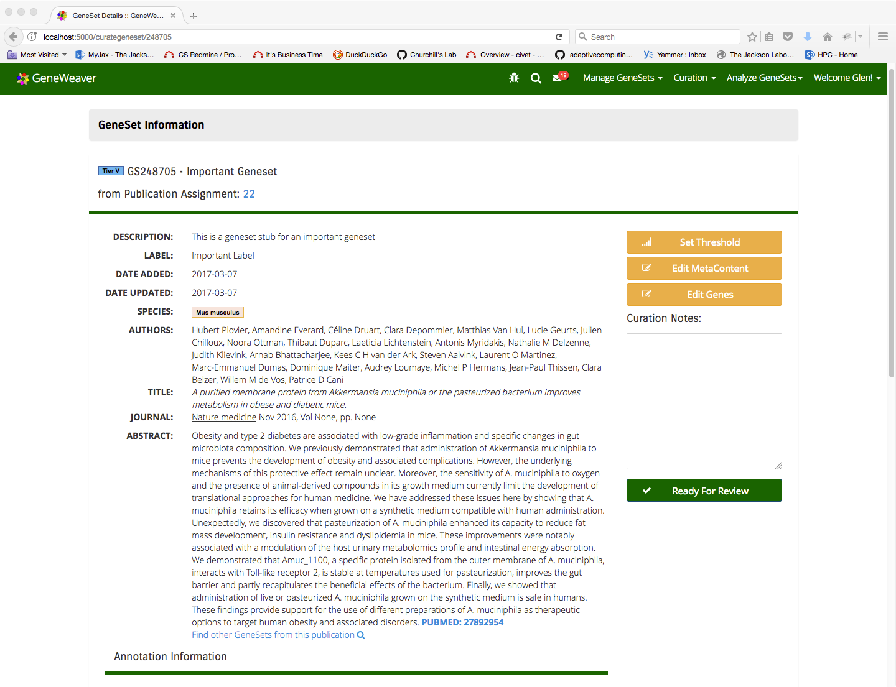
