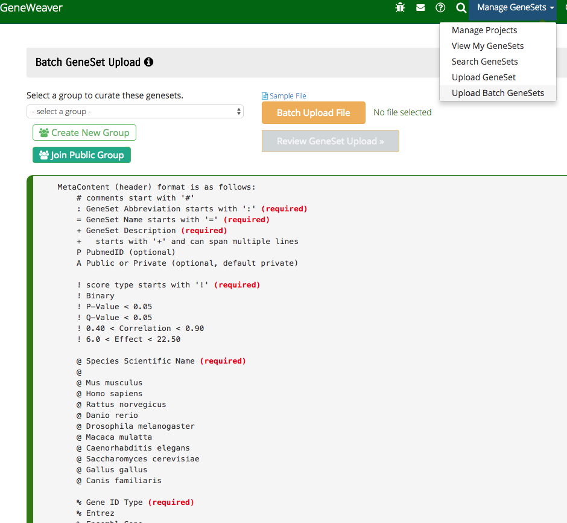

# Batch Gene Set Upload

If you have many gene sets to upload, for example, the results of a clustering analysis,
use the bulk upload form. An example of a bulk upload file is provided. Contact the
GeneWeaver team for assistance with very large batch submissions and integration of
large scale data resources.

On the navigation bar, under "Manage GeneSets" select "Upload Batch GeneSets".

This page requires that a group is selected to curate the genesets. A private group can
be used if the data will not become public. To learn why curation is necessary and how
to curate go [here](../../reference/curation/).

A sample upload file that includes the formatting rules is displayed on the page and a
sample file may also be opened by clicking on the "Sample File" link.

When your file is prepared, click on "Batch Upload File" to select it. Then click on "
Review GeneSet Upload" to start the upload process.

When completec, review the results of the upload and add annotations.
See [gene set details](../view-genesets/#geneset-details-pages). To use your new gene 
set in analyses, you must add it to [projects](../projects/).

