# **Projects**

You must add a gene set to a project in order to be able to select it for analysis.
Projects consist of one or more gene sets. A gene set may be in many projects. A project
may be associated with private and/or public groups.

Projects can be created or selected in several places:

- Immediately after uploading a gene set
- Search results page
- My Projects page
- My GeneSets page

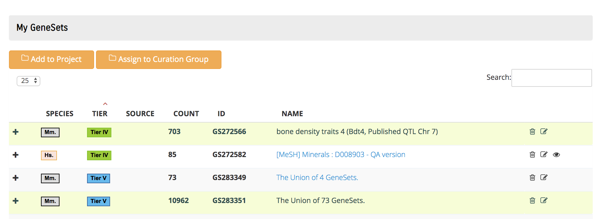

When using the My GeneSets page, click on each desired GeneSet, which is then
highlighted. Then click the Add to Project button.

## My Projects Page

You can get to the My Projects Page from the navigation bar or footer (under Manage
GeneSets) or from the icon in the center of the home page.

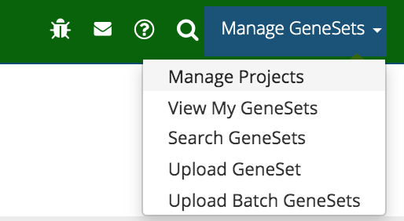{: style="width:50%"}

Use the search box to limit the list of projects by entering text that is included in
the project name(s).

Use the + on the left side of the project to show all its Gene Sets. Use the + on the
right side of the Gene Set to see its figure label, description, and authors.

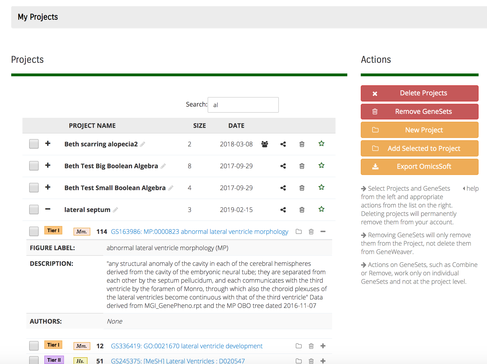

On this page you can use the action buttons on the right side of the page to:

### Delete Projects

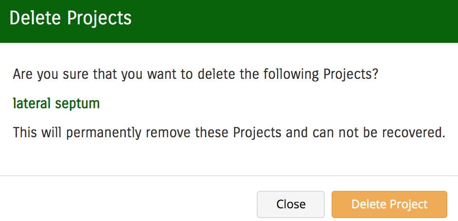{: style="width:70%"}

### Remove Gene Sets from a Project

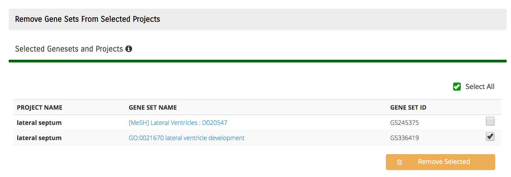

### Create a new Project

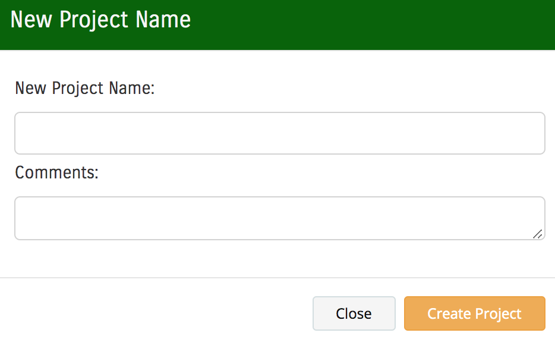{: style="width:70%"}

### Add Gene Sets to Another Project

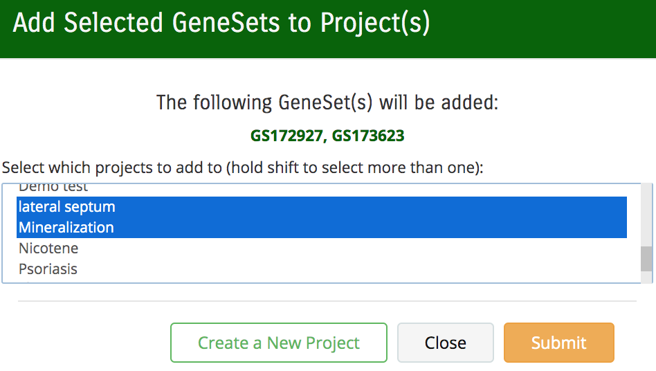{: style="width:70%"}

### Export to OmicsSoft

The projects are listed in table rows that show each project's name, size (number of
Gene Sets), and creation date. There are several icons that can be used for specific
functions:

### Expand/Contract the Project's List of Gene Sets

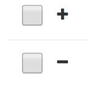

### Edit the Project Name

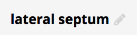

Clicking on the pencil icon will open the Edit Project Name dialog box.

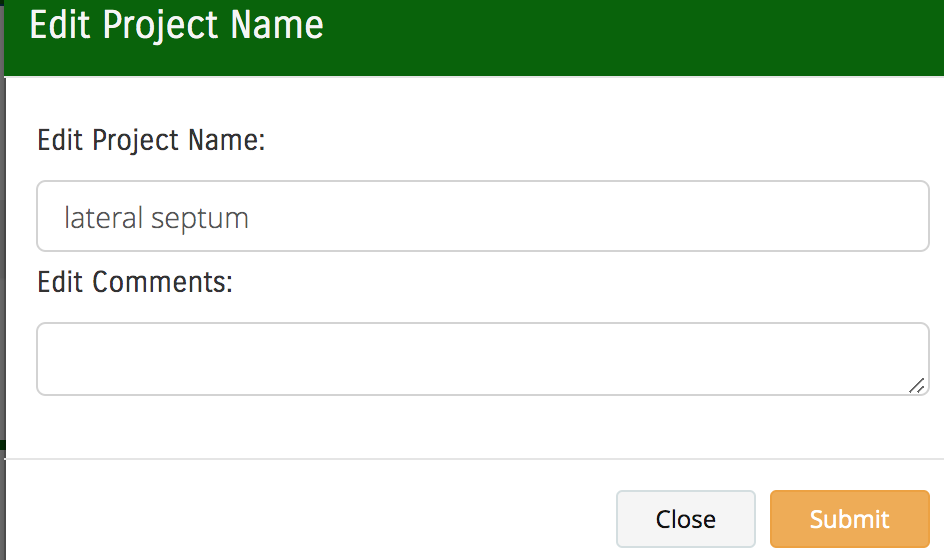{: style="width:70%"}

### Share a Project with a Group

Clicking this icon will open the Share dialog box where you can select multiple groups.

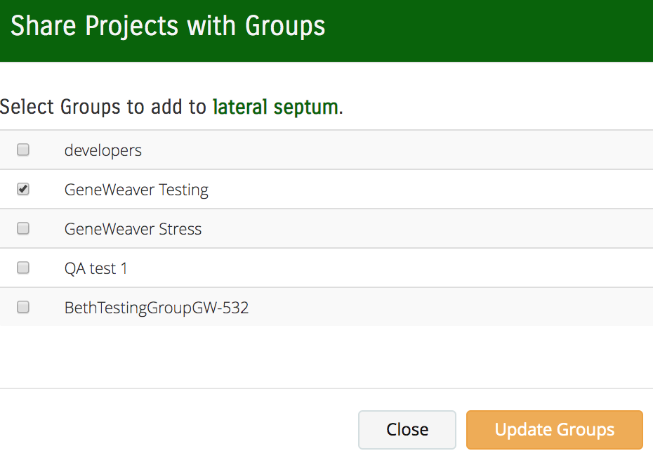{: style="width:70%"}

### View Groups the Project is Shared With

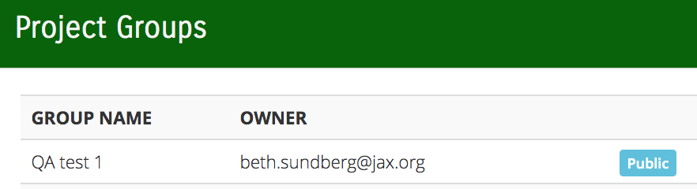{: style="width:70%"}

### The Star Icon is used to Mark Rows of Special Interest

Each Gene Set row includes icons for these functions:

- Add Gene Set to Projects (folder icon)
- Remove Gene Set from Project (trash icon)
- More Information (+ / -)

Clicking the link on the Gene Set name will take you to the [**Gene Set Details
**](../view-genesets/#geneset-details-pages) page.

## Next Steps

Once you have your project(s) in order, go to the [**Analysis**](../../analysis-tools/)
page.

