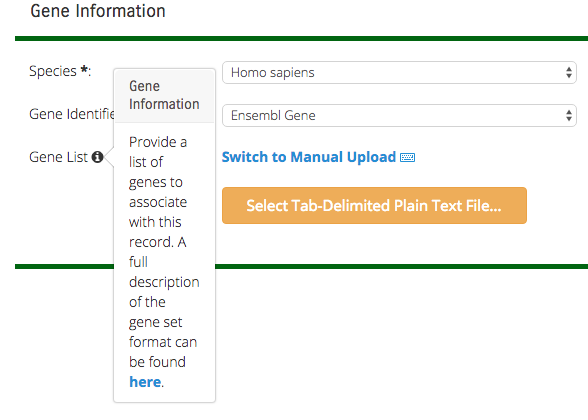
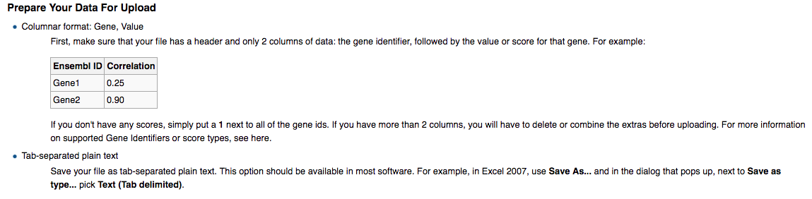

**Uploading Gene Sets**
=======================

To compare individual user generated gene sets among a collection or to the large
database of publicly available sets of genes, gene sets must first be uploaded and added
to analysis projects. Registered users can log in and 
**[upload single gene sets](#upload-a-single-gene-set)** or make use of the 
**[Batch Gene Set Upload](../batch-upload/)** process. If you have questions about
what metadata to enter, see the **[General Definitions](../../reference/curation/general-definitions/)** page and
the **[Standards for Common Gene Set Types](../../reference/curation/geneset-type-standards/)**.

## Upload a Single Gene Set

1. On the Navigation bar, open the Manage GeneSets Menu and select "Upload GeneSet".

2. Fill in the descriptive metacontent fields with a GeneSet name that would be
   interpretable to a general user of GeneWeaver, following
   our [curation standards](../../reference/curation/) and suggestions. A short
   figure label is used to readily identify this gene set in visualization. Select a
   score type used to associate genes with the list, e.g. a p-value, q-value,
   correlation coefficient, effect size or binary association. The GeneSet description
   field should be used to provide detailed information about how the genes were
   associated with the list, including experimental and analysis information, rules for
   inclusion, and source information if the gene set comes from a publication or other
   data resource.

3. Choose Access permissions for your gene set. First, use the pulldown menu to select
   whether this is a public gene set available to any GeneWeaver user, or a private gene
   set available only to you or your groups. Next, if the set is private, use the list
   to select the groups that may access the gene set in database searches and analyses.

4. Provide publication information. If a PubMed ID is available, enter it and click the
   arrows. The publication information will be automatically imported. If the
   publication is pending, or the gene set is not associated with a publication you may
   enter a working title, authors and abstract information.

5. Choose the species and identifier used in your gene list. It is beneficial to use an
   identifier that best reflects the measured genomic feature on your list. For example,
   in a microarray experiment, use the specific probe ids from the microarray, and in a
   transcriptome alignment from RNA seq, use the transcript ID. Gene symbols are
   frequently updated and are sometimes not unique. Once the gene set is in GeneWeaver
   it is straightforward to display the gene symbols that best match the ids used in the
   upload step.

6. Type values, paste them in or select a file containing your gene list and scores by
   clicking on "Switch to File Upload". Format your input as two column tab-delimited
   text. For short gene sets, you may copy and paste a selection into the upload form.
   For larger gene sets, you can prepare a separate text file for upload.

{: style="width:50%"}

7. Click "**Review GeneSet Upload**".

8. Note that if any genes are entered incorrectly they will not be added, only those
   that use a valid gene identifier will be included.

9. Review results of the upload and add annotations.
   See [gene set details](../view-genesets/#geneset-details-pages). To use your new gene set in analyses,
   you must add it to [projects](../projects/). 

