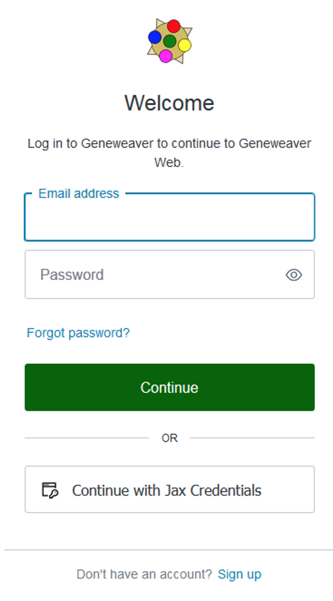
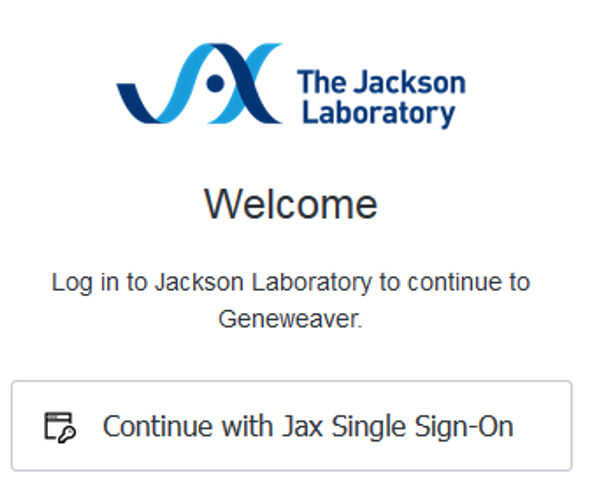
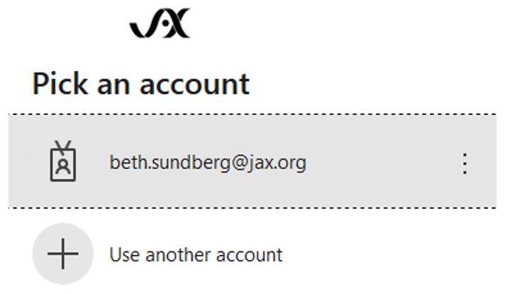
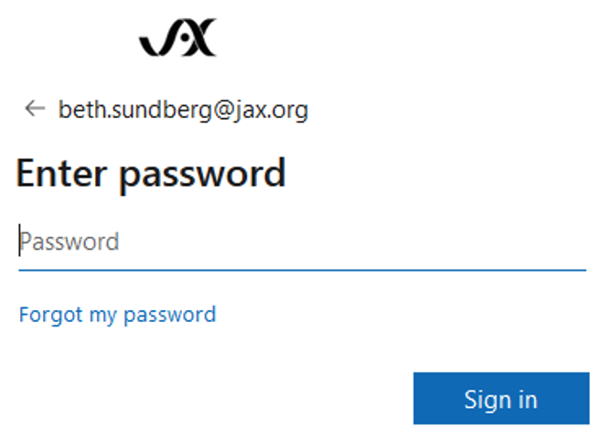
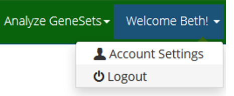

# **User Registration and Single Sign-On**
GeneWeaver is transitioning to a new login procedure that will allow the use of **Single Sign-On (SSO)** and eliminate needing a GeneWeaver specific password.

**OAuth** is an open standard for access delegation, commonly used as a way for Internet users to grant websites or applications access to their information on other websites but without giving them the passwords. 

OAuth is being used as part of Single Sign-On (SSO), an identification system that allows websites to use other, trusted sites to verify users. This frees businesses from the need to hold passwords in their databases, cuts down on login troubleshooting, and decreases the damage a hack can cause. SSO systems work sort of like ID cards.

Below is the new login page:

{: style="width:50%"}

## Logging in or registering if you are not a Jackson Laboratory user

Over time we will be adding the ability to use SSO for users that do not have a Jackson Laboratory email. Until then, continue to log in or register using your current email and GeneWeaver specific password.

## Logging in or registering with SSO

Existing user accounts with a Jackson Laboratory email have already been migrated to the new system. 

Instead of using your previous email address and password, select “Continue with Jax Credentials”. 

Note that if you are unable to use SSO credentials, your previous GeneWeaver email and password will still work for logging in.

This example will continue using Jax Single Sign-On.

{: style="width:50%"}

Select your account.

{: style="width:50%"}

Enter your password. For internal Jax users, Jax SSO uses your domain password.

{: style="width:50%"}

Success brings you to the GeneWeaver home page. Note your name is displayed on the menu bar.

{: style="width:50%"}

Now that you are using SSO, your previous GeneWeaver password will no longer work.
 
* Always use the SSO method. 
* Do not try to use the GeneWeaver account settings page to change your password. 
* Do not use the GeneWeaver reset password page to change your password.

To logout use the same menu choice as before.

{: style="width:50%"}

### I’m confused, why is there an OAuth and Auth0?

[OAuth 2.0](https://oauth.net/2/) is a standardized authorization protocol, [Auth0](https://auth0.com/) is a company that sells an identity management platform with authentication and authorization services that *implements* the OAuth2 protocol (among others).

