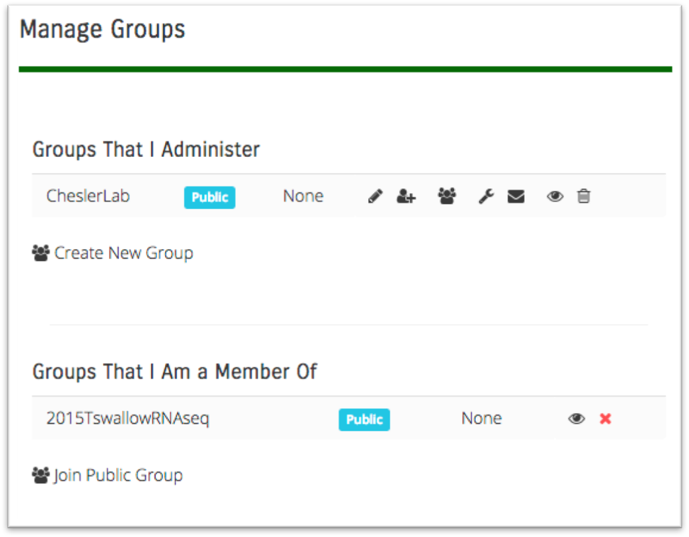
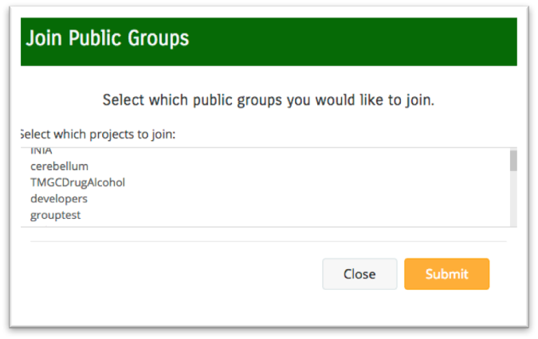

**Users and Groups**
====================
GeneWeaver is available without registration to enable all users to search the database
and analyze gene sets. Registered users can access several additional features including
long-term storage of gene sets, projects and results. Registered users can also form 
groups, designate administrators and share gene sets, projects and results to the 
members of their user group.

### Guest User

If you prefer to not register, you will become a guest user by doing a search, selecting
some gene sets and adding them to a new project. This project can be used by the
analysis tools but will not persist beyond 24 hours.

### Registration

All pages contain a navigation bar at the top. In the right hand corner, click on "
Welcome Guest" and select "Create Account". The only information needed is your name,
email and a password. Jackson Laboratory users should use "Continue with Jax
Credentials" ([Single Sign-On](../user-registration/)). Other SSO log in
options will be added in the future.

### Accounts Page

Once registered, use the Welcome drop-down to log in. A logged-in user will see Welcome
and their name on the navigation bar. Click there and select "Account Settings". There
also is a link to the Account Settings page on the page footer.

On your accounts page find the **Manage Groups** section. Here you can select the
appropriate icons to:

- Create/Delete Group
- Edit / Add / Delete Members
- Email Members
- View Members
- View Curation Tasks
- Set Group Administration Options

Your group can be private, only the members you choose can use it, or public to all.

By selecting the **Join Public Group** icon at the bottom of this section, a modal will
be displayed allowing you to join one of many publicly available groups.

The accounts page is where you can:

- Change your password if you are not using Single Sign-On
- Choose to receive email notifications
- Generate an API Key
- Elect a Text Annotator (Monarch, NCBO or Both)
- Edit your name or email address

