# View My Genesets

Genesets that you added are listed on the View My Genesets page. They can be added by
uploading or using some of the tools, such as the boolean algebra tool.

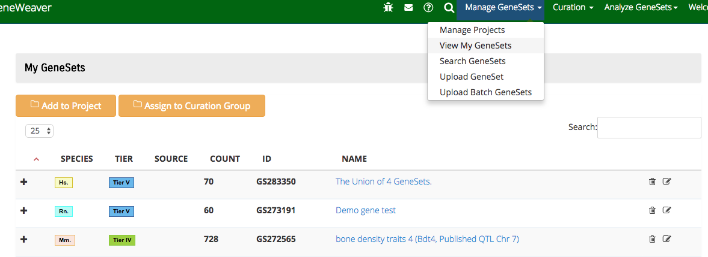

Clicking on a geneset on this page will highlight it in yellow. Several can be selected
this way and then added to a project or assigned to a curation group. The list can be
sorted by clicking on a column header. Typing in the Search box will filter the list of
genesets. The filter is case sensitive. Clicking the link on the geneset name will open
the [geneset details page](#geneset-details-pages). Clicking the edit icon will open
the [edit geneset page](#edit-geneset-page).

## Geneset Details Pages

This page provides a comprehensive look at all the information that has been entered
about a geneset. You can get to this page by clicking a link on the geneset name from
any page that lists genesets, such as the My Geneset page, search results and some of
the tool results.

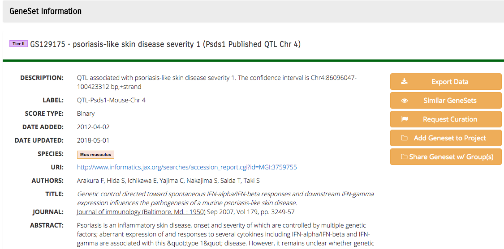

The basic information is displayed here in detail: geneset name, geneset id number,
tier, description, figure label, score type, date added, date of the most recent update,
species and the publication information: URI, authors, title, journal and abstract.
Scroll the page down to see the color coded annotation information from several ontology
databases. Click on a link for any term to open the ontology webpage describing the
term.

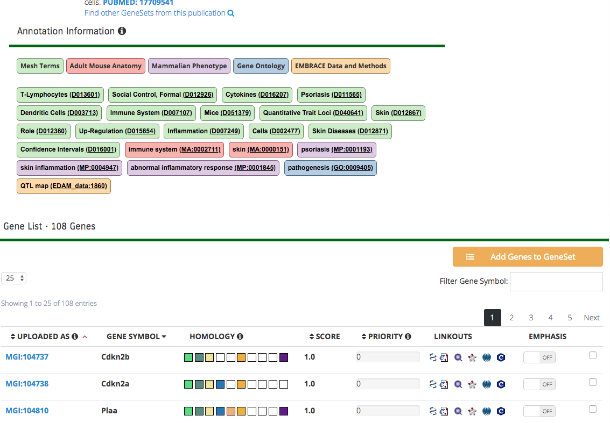

Further down on the page is a list of all the genes. If the list is long, it will be
displayed using several pages. The "uploaded as" column shows the identifier used when
this gene was uploaded. Select a choice in the "gene symbol" column to show the
corresponding identifier in various other formats. Mouse over the "homology" boxes to
see homology mappings to other species in GeneWeaver. The "linkouts" column contains
icons allowing you to link to other websites, including Entrez, Ensembl, Gene Network,
String, Allen Brain Atlas and Comparative Toxicogenomics Database. Other columns include
the score, priority and emphasis.

Check the box in the final column to select that gene to be added to another geneset by
using the "Add Genes to GeneSet" button.

The sort order of the columns can be changed by clicking on the uploaded as, score or
priority columns. The genes listed can be limited by entering a gene in the "Filter Gene
Symbol" box.

At the top right of the page are several buttons:

* Export Data has 3 formats:
    1. Export Data: a text file containing all the gene symbols for each gene
    2. Export OmicsSoft
    3. Export GeneSet Complete: a text file that can be used by GeneWeaver's batch
       upload function.

* [Similar Genesets](#similar-genesets) will open a page showing the top 1,000
  GeneWeaver genesets that are similar to this one.
* Request Curation
* Add Geneset to a Project
* Share Geneset w/ Group(s)

If you originally created the geneset that is displayed, then there are more functional
buttons present that allow you to make changes.

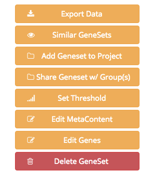

The "Set Threshold" button opens a new page where you can change the significance
threshold.

The "Delete GeneSet" button will ask you to confirm that you want the geneset removed.

Using the "Edit MetaContent" and "Edit Genes" buttons will open the edit geneset page.

## Edit Geneset Page

You get to the edit geneset page from the geneset details page or from the upload
geneset page. On this page is both a link and a button you can use to go to the geneset
details page. Be sure to click on **"Save Updates"** before leaving the page if you have
made any changes.

### Edit MetaContent

Click the "Edit MetaContent" button and the top portion of the page changes to a format
that allows editing.

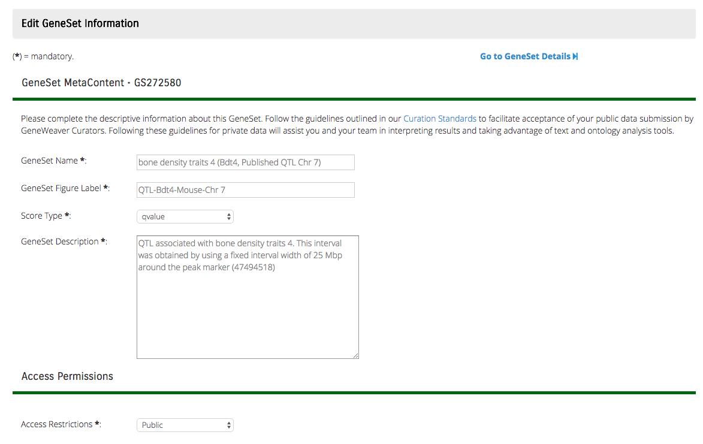

Here you can change the name, figure label, score type, description and access
restrictions. If you know the **PubMed ID**, enter it and click the link next to the box
for it to be looked up. Alternatively, click on "Manual Entry" and fill in the
information.

### Ontology Annotations

Scroll below the publication area to see the ontology annotations.

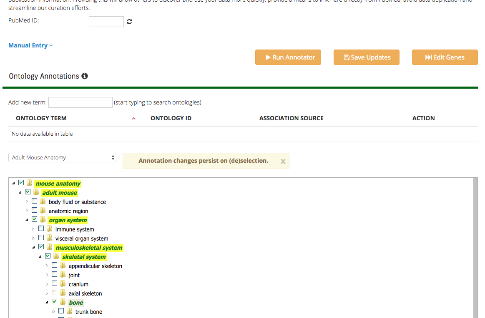

You can enter a term in the box to search the ontologies for it. Click to select the
desired one. Or select an ontology from the selection box. Click to expand the hierarchy
and check the desired term(s).

Click the "Save Updates" button.

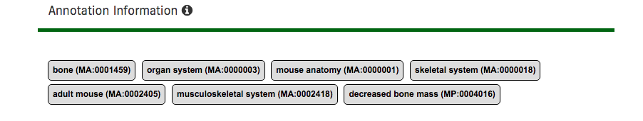

In the Edit Metatdata mode, the ontology terms are displayed in a fashion that allows
removal. The ontology columns can be sorted by clicking on the header.

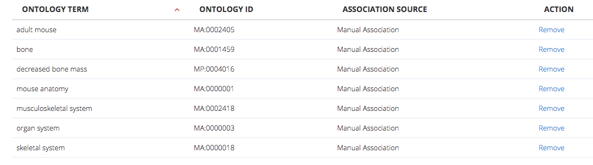

### Edit Genes

Click the "Edit Genes" button to see an editable list of all the genes in the geneset.
They will be displayed on the screen below the annotations.

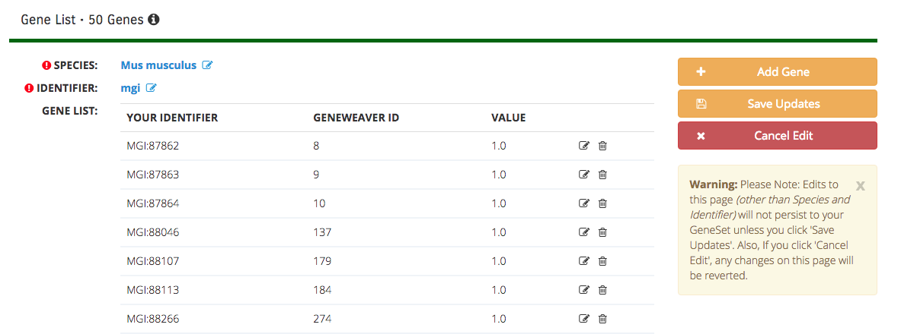

In the editing mode, you can change the species or identifier. Click on the edit icon
for a gene and a form will open so you can edit the identifier or score. Click the trash
icon to remove a gene from the geneset. Click on the "Add Gene" button to add another
gene to the geneset. Make sure to click on "Save Updates" when you are done.

## Similar Genesets

The view geneset details page has a button linking to this page. A message will be
displayed if a similarity analysis needs to be run on the geneset with an option to "
Click here to start now". There also is a button on the page that allows you to "Refresh
Similar GeneSets" if the analysis is old.

The "Export GeneSets" button will create a "csv" file of all the similar GeneSets. The
columns include: geneset id, name, number of genes, and Jaccard Similarity score.

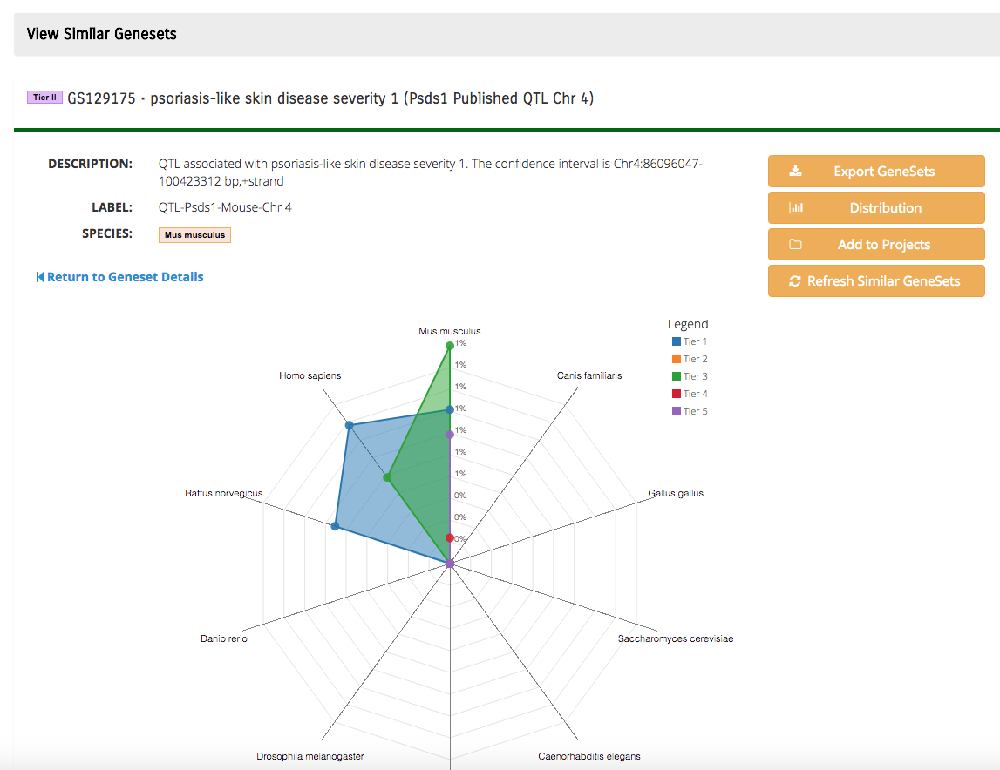

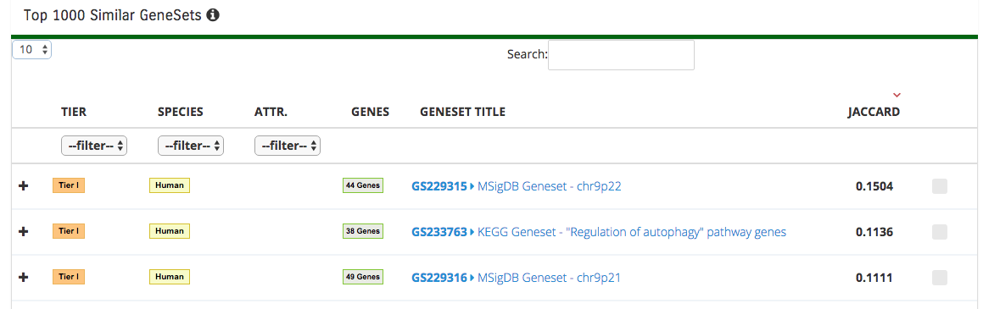

Scroll down to see the list of similar genesets. You may select between 10 and 100 to
display per page. This list will be sorted by the Jaccard Similarity. Click on any
column to change the sort order. The tier, species and attribution columns allow
selecting a filter in order to limit the number of genesets. You may also enter a string
of characters into the "Search" box to filter the list by the geneset name.

Check the box to the right of any genesets and use the "Add to Projects" button if you
desire to keep a selection of these genesets for use later.

Click on the "Distribution" button to add a distribution graph to the page.

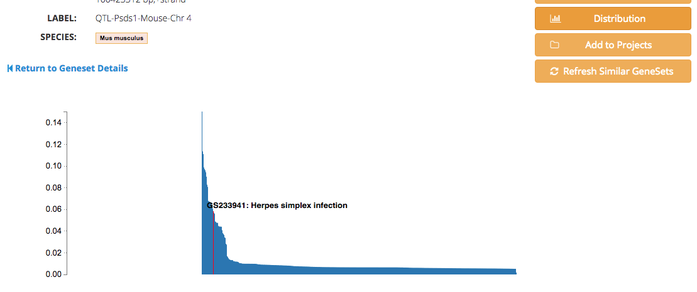

Hover your mouse over the graph to see where each geneset is plotted.

