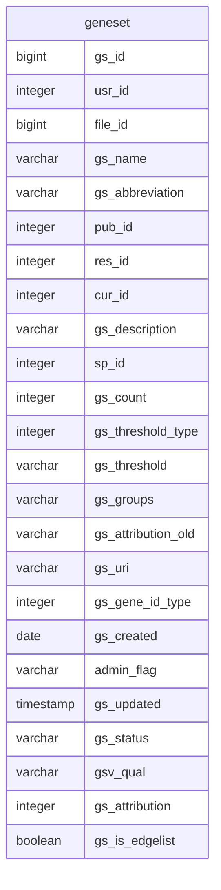
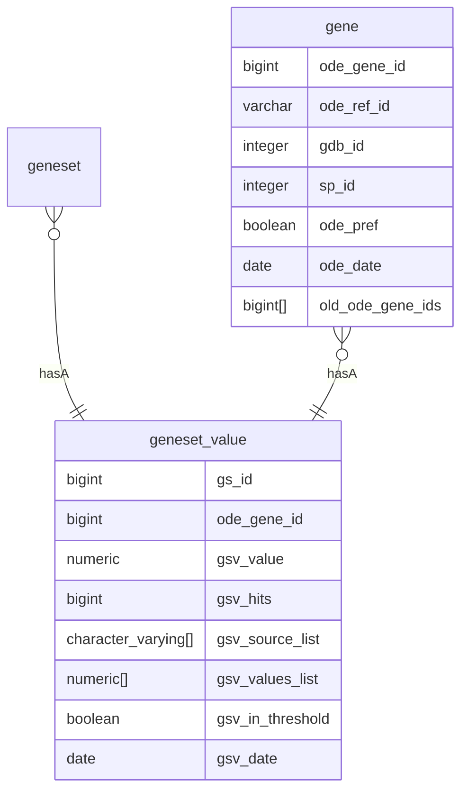
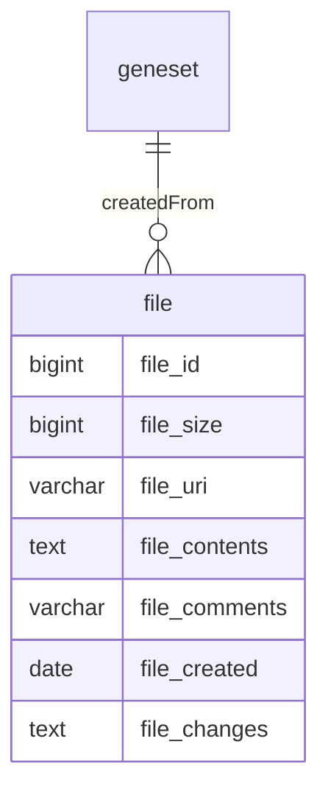
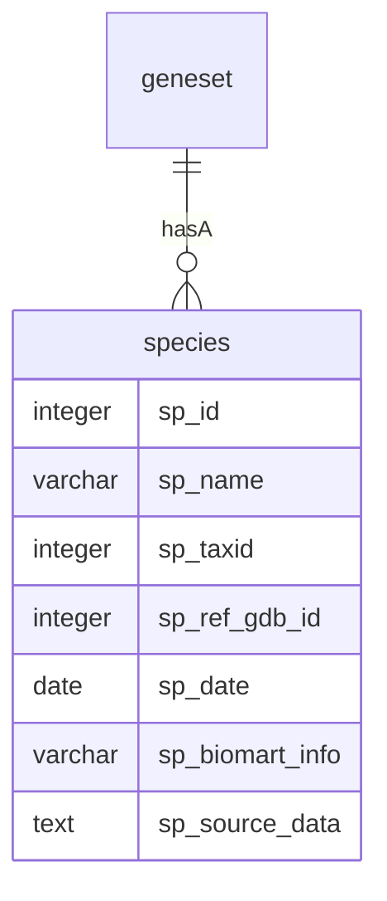
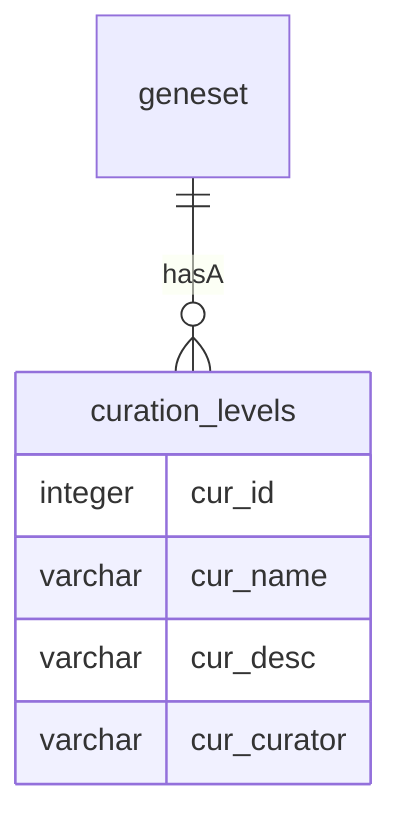
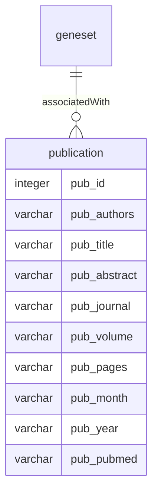
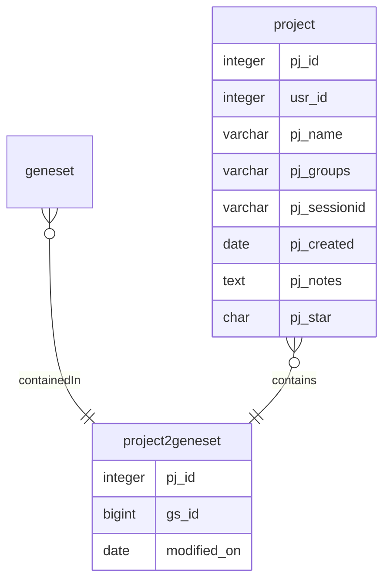
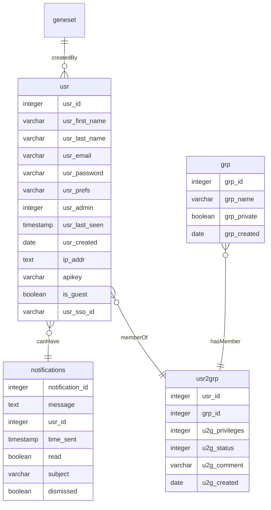
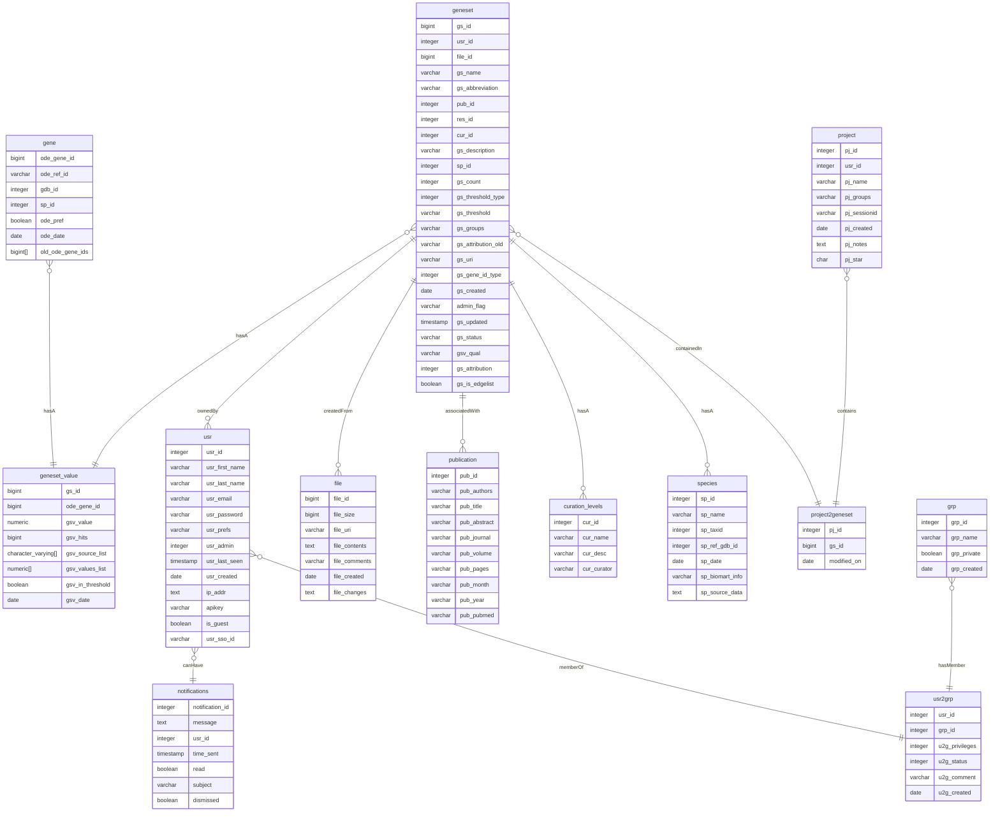

!!! warning "Work In Progress"
    [//]: # (TODO)
    This page is currently under construction, and not **all** tables in the data model
    are currently listed on this page. 

### Geneset Table
The geneset table is the heart of the geneweaver data model. The geneset table is 
contained in the `production` schema. The geneset table contains the following columns:

##### Genes & Geneset Values
Geneset values are the genomic features in the geneset. The geneset values table is
contained in the `extsrc` schema. The geneset values table is an associative table
between the geneset table and the gene table. The geneset values table and the genes
table contain the following columns:

##### Files
Genesets are created from user uploaded files. The file table is contained in the
`production` schema. The file table contains the following columns:

##### Species
Genesets are of a species, that is, the genomic features in the geneset are from a
specific species. The species table is contained in the `odestatic` schema. The species
table contains the following columns:

##### Tier (Curation Level)
Geneset tiers are indicated using the curation levels table. The curation levels table
is contained in the `odestatic` schema. The curation levels table contains the following
columns:

##### Publications
Genesets can be associated with publications. The publication table is contained in the
`production` schema. The publication table contains the following columns:

##### Projects
Genesets can be added to projects. Project membership is modeled using an associative
(intermediate) table named the `project2geneset` table. The project and project2geneset
tables are contained in the `production` schema. The tables contain the following 
columns:

### User Table
The user table is used to store user information, and is used to associate users with
other Geneweaver entities.

### Full Relational Diagram

!!! danger "Work In Progress"
    [//]: # (TODO)
    This page is currently under construction, and not **all** tables in the data model
    are currently listed on this page. This diagram **only** contains tables that have
    been defined in the page, and **does not** represent the full data model.

